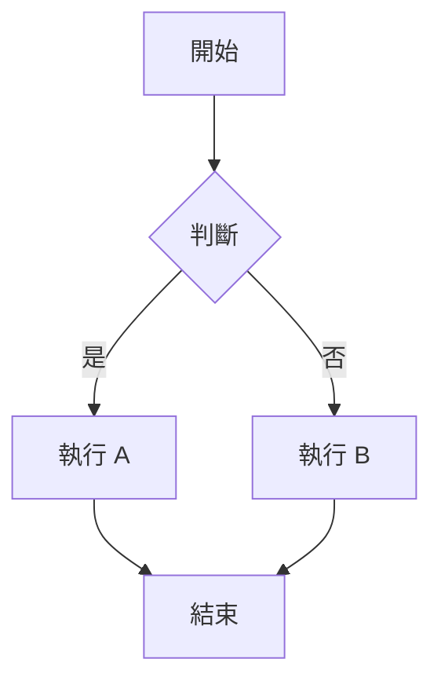

# Fluxio - Hugo Blog with Parsa Theme

基於 [Parsa Hugo Theme](https://github.com/themefisher/parsa-hugo) 的現代化部落格模板，已整合 SEO、多語系、追蹤分析、Mermaid 圖表等功能。

---

## 📋 目錄

- [功能特色](#-功能特色)
- [專案結構](#-專案結構)
- [快速開始](#-快速開始)
- [設定說明](#-設定說明)
  - [基本設定](#基本設定)
  - [多語系設定](#多語系設定)
  - [SEO 設定](#seo-設定)
  - [Open Graph / Twitter Card](#open-graph--twitter-card)
  - [Geo SEO 地理位置](#geo-seo-地理位置)
  - [Google Analytics](#google-analytics)
  - [Facebook Pixel](#facebook-pixel)
  - [Google AdSense](#google-adsense)
  - [Google Fonts](#google-fonts)
  - [Mermaid 圖表](#mermaid-圖表)
  - [KaTeX 數學公式](#katex-數學公式)
  - [YouTube 影片嵌入](#youtube-影片嵌入)
  - [Sitemap 與 Robots.txt](#sitemap-與-robotstxt)
- [Front Matter 範例](#-front-matter-範例)
- [檔案結構說明](#-檔案結構說明)
- [部署至 Search Console](#-部署至-search-console)

---

## ✨ 功能特色

| 功能 | 說明 |
|------|------|
| 🔍 **SEO 優化** | 完整的 meta description、canonical URL、結構化資料 |
| 📱 **Open Graph** | Facebook、LINE 等社群平台分享預覽 |
| 🐦 **Twitter Card** | Twitter 分享時顯示大圖卡片 |
| 🌍 **Geo SEO** | 地理位置標記，強化本地搜尋 |
| 🌐 **多語系** | 支援英文、簡體中文、繁體中文 |
| 📊 **Google Analytics** | GA4 整合，追蹤網站流量 |
| 📈 **Facebook Pixel** | 追蹤 Facebook 廣告成效 |
| 💰 **Google AdSense** | 廣告收益整合 |
| 🔤 **Google Fonts** | 自訂網頁字型 |
| 📊 **Mermaid** | 支援流程圖、序列圖等圖表渲染 |
| 📐 **KaTeX** | 數學公式渲染，支援 LaTeX 語法 |
| 📋 **程式碼複製** | 程式碼區塊一鍵複製按鈕 |
| 🎬 **YouTube** | 響應式 YouTube 影片嵌入 |
| 🗺️ **Sitemap** | 自動產生多語系 sitemap |
| 🤖 **Robots.txt** | 自訂爬蟲規則，支援 AI 爬蟲 |

---

## 📁 專案結構

```
fluxio/
├── archetypes/              # 內容模板
├── assets/                  # 資源檔案 (CSS/JS)
├── content/                 # 文章內容
│   ├── en/                  # 英文內容
│   ├── zh-CN/               # 簡中內容
│   └── zh-TW/               # 繁中內容
├── data/                    # 資料檔案
├── i18n/                    # 多語系翻譯
│   ├── en.toml              # 英文
│   ├── zh-CN.toml           # 簡體中文
│   └── zh-TW.toml           # 繁體中文
├── layouts/                 # 自訂模板 (覆寫主題)
│   ├── partials/
│   │   ├── head.html        # SEO/OG/Twitter/Geo meta
│   │   ├── analytics.html   # GA/FB Pixel/AdSense
│   │   ├── mermaid.html     # Mermaid 圖表
│   │   └── math.html        # KaTeX 數學公式
│   ├── shortcodes/
│   │   └── youtube.html     # YouTube 嵌入 shortcode
│   └── robots.txt           # robots.txt 模板
├── static/                  # 靜態檔案
│   └── images/
│       ├── default-og.jpg   # 預設 OG 圖片
│       ├── og-image.jpg     # 站台 OG 圖片
│       └── favicon.png      # 網站圖示
├── themes/
│   └── parsa/               # Parsa 主題 (git submodule)
└── hugo.toml                # Hugo 設定檔
```

---

## 🚀 快速開始

### 1. 複製專案

```bash
git clone --recursive https://github.com/your-username/fluxio.git
cd fluxio
```

### 2. 安裝 Hugo

```bash
# macOS
brew install hugo

# Windows
choco install hugo-extended

# 驗證安裝
hugo version
```

### 3. 啟動開發伺服器

```bash
hugo server -D
```

瀏覽器開啟 `http://localhost:1313`

### 4. 建置靜態網站

```bash
hugo --minify
```

輸出至 `public/` 目錄

---

## ⚙️ 設定說明

所有設定都在 `hugo.toml` 檔案中進行。

### 基本設定

```toml
# 網站基本資訊
baseURL = 'https://your-domain.com/'
title = '網站名稱'
theme = 'parsa'

# 預設語言
defaultContentLanguage = 'zh-TW'
defaultContentLanguageInSubdir = false

# 啟用 robots.txt
enableRobotsTXT = true
```

| 參數 | 說明 | 範例 |
|------|------|------|
| `baseURL` | 網站正式網址（含結尾斜線） | `https://blog.example.com/` |
| `title` | 網站名稱 | `我的部落格` |
| `theme` | 使用的主題名稱 | `parsa` |
| `defaultContentLanguage` | 預設語言代碼 | `zh-TW`、`en`、`zh-CN` |
| `enableRobotsTXT` | 啟用自訂 robots.txt | `true` |

---

### 多語系設定

支援三種語言：英文、簡體中文、繁體中文。

```toml
[languages]
  # 英文
  [languages.en]
    languageCode = 'en-US'
    languageName = 'English'
    weight = 1
    title = 'My Blog'
    [languages.en.params]
      description = 'A modern Hugo blog'

  # 簡體中文
  [languages.zh-CN]
    languageCode = 'zh-CN'
    languageName = '简体中文'
    weight = 2
    title = '我的博客'
    [languages.zh-CN.params]
      description = '一个现代化的 Hugo 博客'

  # 繁體中文
  [languages.zh-TW]
    languageCode = 'zh-TW'
    languageName = '繁體中文'
    weight = 3
    title = '我的部落格'
    [languages.zh-TW.params]
      description = '一個現代化的 Hugo 部落格'
```

#### 多語系內容目錄結構

```
content/
├── en/
│   └── posts/
│       └── my-first-post.md
├── zh-CN/
│   └── posts/
│       └── my-first-post.md
└── zh-TW/
    └── posts/
        └── my-first-post.md
```

#### 新增/修改翻譯字串

編輯 `i18n/` 目錄下對應語言的 `.toml` 檔案：

```toml
# i18n/zh-TW.toml
[read_more]
other = "閱讀更多"

[categories]
other = "分類"
```

在模板中使用：

```html
{{ i18n "read_more" }}
```

---

### SEO 設定

```toml
[params]
  # 站台描述（用於 meta description）
  description = '這是我的部落格，分享技術文章與生活點滴'
  
  # 作者名稱
  author = 'Your Name'
```

#### Meta Description 優先順序

1. 頁面 front matter 的 `description`
2. 站台 `params.description`
3. 空值

#### 自動產生的 SEO 標籤

```html
<!-- 基本 SEO -->
<meta name="description" content="頁面描述">
<meta name="author" content="作者名稱">
<link rel="canonical" href="https://your-domain.com/posts/my-post/">

<!-- 多語系替代連結 -->
<link rel="alternate" hreflang="en" href="https://your-domain.com/en/posts/my-post/">
<link rel="alternate" hreflang="zh-TW" href="https://your-domain.com/zh-TW/posts/my-post/">
<link rel="alternate" hreflang="x-default" href="https://your-domain.com/posts/my-post/">
```

---

### Open Graph / Twitter Card

#### 預設圖片設定

```toml
[params]
  # 當頁面沒有圖片時使用的預設圖片
  default_image = 'images/default-og.jpg'
  
  # 站台 OG 圖片
  og_image = 'images/og-image.jpg'
```

#### 圖片優先順序

1. 頁面 front matter 的 `image`
2. 頁面 front matter 的 `og_image`
3. 站台 `params.og_image`
4. 站台 `params.default_image`

#### Twitter 設定

```toml
[params]
  # Twitter 帳號（不含 @）
  twitter_site = 'your_twitter_handle'
  twitter_creator = 'your_twitter_handle'
```

#### 自動產生的標籤

```html
<!-- Open Graph -->
<meta property="og:site_name" content="網站名稱">
<meta property="og:title" content="文章標題">
<meta property="og:description" content="文章描述">
<meta property="og:type" content="article">
<meta property="og:url" content="https://your-domain.com/posts/my-post/">
<meta property="og:image" content="https://your-domain.com/images/og-image.jpg">
<meta property="og:locale" content="zh-TW">

<!-- 文章頁額外標籤 -->
<meta property="article:section" content="posts">
<meta property="article:published_time" content="2024-01-15T10:00:00+08:00">
<meta property="article:modified_time" content="2024-01-20T15:30:00+08:00">
<meta property="article:tag" content="Hugo">
<meta property="article:tag" content="SEO">

<!-- Twitter Card -->
<meta name="twitter:card" content="summary_large_image">
<meta name="twitter:title" content="文章標題">
<meta name="twitter:description" content="文章描述">
<meta name="twitter:image" content="https://your-domain.com/images/og-image.jpg">
<meta name="twitter:site" content="@your_twitter_handle">
<meta name="twitter:creator" content="@your_twitter_handle">
```

---

### Geo SEO 地理位置

適用於有實體服務地點的網站，強化本地搜尋結果。

```toml
[params.geo]
  region = 'TW-TPE'           # ISO 3166-2 區域代碼
  placename = 'Taipei'        # 城市名稱
  position = '25.0330;121.5654'  # 緯度;經度
```

#### 常用地區代碼

| 城市 | region | placename | position |
|------|--------|-----------|----------|
| 台北 | `TW-TPE` | `Taipei` | `25.0330;121.5654` |
| 台中 | `TW-TXG` | `Taichung` | `24.1477;120.6736` |
| 高雄 | `TW-KHH` | `Kaohsiung` | `22.6273;120.3014` |
| 上海 | `CN-SH` | `Shanghai` | `31.2304;121.4737` |
| 北京 | `CN-BJ` | `Beijing` | `39.9042;116.4074` |
| 東京 | `JP-13` | `Tokyo` | `35.6762;139.6503` |
| 新加坡 | `SG` | `Singapore` | `1.3521;103.8198` |

#### 自動產生的標籤

```html
<meta name="geo.region" content="TW-TPE">
<meta name="geo.placename" content="Taipei">
<meta name="geo.position" content="25.0330;121.5654">
<meta name="ICBM" content="25.0330, 121.5654">
```

---

### Google Analytics

使用 GA4 追蹤網站流量。

```toml
[params]
  # GA4 Measurement ID（以 G- 開頭）
  google_analytics = 'G-XXXXXXXXXX'
```

#### 如何取得 GA4 ID

1. 登入 [Google Analytics](https://analytics.google.com/)
2. 管理 → 資料串流 → 選擇網站串流
3. 複製「評估 ID」(格式：`G-XXXXXXXXXX`)

#### 條件輸出

若 `google_analytics` 未設定或為空值，**不會**輸出任何 GA 相關程式碼。

---

### Facebook Pixel

追蹤 Facebook 廣告成效與轉換。

```toml
[params]
  # Facebook Pixel ID（純數字）
  facebook_pixel = 'XXXXXXXXXXXXXXX'
```

#### 如何取得 Pixel ID

1. 登入 [Facebook Events Manager](https://www.facebook.com/events_manager2/)
2. 資料來源 → 選擇 Pixel → 複製 Pixel ID

#### 條件輸出

若 `facebook_pixel` 未設定或為空值，**不會**輸出任何 FB Pixel 相關程式碼。

---

### Google AdSense

整合 Google AdSense 廣告。

```toml
[params]
  # AdSense Publisher ID（以 ca-pub- 開頭）
  google_adsense = 'ca-pub-XXXXXXXXXXXXXXXX'
```

#### 如何取得 Publisher ID

1. 登入 [Google AdSense](https://www.google.com/adsense/)
2. 帳戶 → 帳戶資訊 → 複製「發布商 ID」

#### 條件輸出

若 `google_adsense` 未設定或為空值，**不會**輸出任何 AdSense 相關程式碼。

---

### Google Fonts

載入 Google Fonts 字型。

```toml
[params]
  # Google Fonts 參數（從 Google Fonts 網站複製）
  google_fonts = 'family=Noto+Sans+TC:wght@400;500;700&family=Fira+Code'
```

#### 如何設定

1. 前往 [Google Fonts](https://fonts.google.com/)
2. 選擇想要的字型
3. 點擊「Get embed code」
4. 複製 `?` 後面的參數

#### 範例

```toml
# 單一字型
google_fonts = 'family=Inter:wght@400;500;600;700'

# 多個字型
google_fonts = 'family=Noto+Sans+TC:wght@400;700&family=JetBrains+Mono'

# 含斜體
google_fonts = 'family=Roboto:ital,wght@0,400;0,700;1,400'
```

#### 在 CSS 中使用

```css
body {
  font-family: 'Noto Sans TC', sans-serif;
}

code {
  font-family: 'Fira Code', monospace;
}
```

---

### Mermaid 圖表

支援在 Markdown 中渲染 Mermaid 圖表。

#### 全站啟用

```toml
[params]
  mermaid = true
  mermaid_theme = 'default'  # 可選：default, dark, forest, neutral
  mermaid_font = 'inherit'   # 使用網站字型
```

#### 單頁啟用

在文章 front matter 中設定：

```yaml
---
title: "我的文章"
mermaid: true
---
```

#### Markdown 中使用

````markdown

````

#### 支援的圖表類型

- **Flowchart** - 流程圖
- **Sequence Diagram** - 序列圖
- **Class Diagram** - 類別圖
- **State Diagram** - 狀態圖
- **Entity Relationship Diagram** - ER 圖
- **Gantt Chart** - 甘特圖
- **Pie Chart** - 圓餅圖
- **Git Graph** - Git 分支圖
- **Mind Map** - 心智圖
- **User Journey** - 使用者旅程圖

---

### KaTeX 數學公式

支援使用 LaTeX 語法渲染數學公式。

#### 全站啟用

```toml
[params]
  math = true
```

#### 單頁啟用

在文章 front matter 中設定：

```yaml
---
title: "數學文章"
math: true
---
```

#### Goldmark Passthrough 設定

本模板已配置 Hugo Goldmark Passthrough 擴展，使數學公式定界符不會被 Markdown 解析器處理，而是直接傳遞給 KaTeX 渲染。

```toml
# hugo.toml 中的設定
[markup.goldmark.extensions.passthrough]
  enable = true
  [markup.goldmark.extensions.passthrough.delimiters]
    block = [['$$', '$$'], ['\\[', '\\]']]
    inline = [['$', '$'], ['\\(', '\\)']]
```

這解決了以下問題：
- 避免 `$...$` 中的底線 `_` 被解析為斜體
- 避免 `$$...$$` 區塊公式中的反斜線 `\` 被錯誤處理
- 確保複雜的 LaTeX 語法能正確傳遞給 KaTeX

#### 行內公式

使用單個 `$` 符號包圍：

```markdown
愛因斯坦的質能方程式 $E = mc^2$ 改變了物理學。
```

#### 區塊公式

使用雙 `$$` 符號包圍：

```markdown
$$
\int_{-\infty}^{\infty} e^{-x^2} dx = \sqrt{\pi}
$$
```

#### 聯立方程式

```markdown
$$
\begin{cases}
3x + 2y - z = 1 \\
2x - 2y + 4z = -2 \\
-x + \frac{1}{2}y - z = 0
\end{cases}
$$
```

#### 矩陣

```markdown
$$
\mathbf{A} = \begin{pmatrix}
a_{11} & a_{12} & a_{13} \\
a_{21} & a_{22} & a_{23} \\
a_{31} & a_{32} & a_{33}
\end{pmatrix}
$$
```

#### 常用語法

| 語法 | 結果 | 說明 |
|------|------|------|
| `$x^2$` | x² | 上標 |
| `$x_i$` | xᵢ | 下標 |
| `$\frac{a}{b}$` | a/b | 分數 |
| `$\sqrt{x}$` | √x | 根號 |
| `$\sum_{i=1}^{n}$` | Σ | 求和 |
| `$\int_{a}^{b}$` | ∫ | 積分 |
| `$\lim_{x \to 0}$` | lim | 極限 |
| `$\alpha, \beta, \gamma$` | α, β, γ | 希臘字母 |

---

### YouTube 影片嵌入

使用自訂 shortcode 嵌入 YouTube 影片。

#### 基本用法

```markdown

```

將 `VIDEO_ID` 替換為 YouTube 影片的 ID（網址 `v=` 後面的部分）。

#### 範例

```markdown

```

#### 帶參數的用法

```markdown

```

| 參數 | 說明 | 預設值 |
|------|------|--------|
| `id` | YouTube 影片 ID | 必填 |
| `title` | 影片標題（無障礙） | "YouTube Video" |
| `start` | 開始播放秒數 | 0 |
| `autoplay` | 自動播放 | false |

#### 響應式設計

嵌入的影片會自動適應容器寬度，在手機和桌面都能正常顯示。

---

### Sitemap 與 Robots.txt

#### Sitemap 設定

```toml
[sitemap]
  changefreq = 'daily'      # 更新頻率：always, hourly, daily, weekly, monthly, yearly, never
  filename = 'sitemap.xml'  # 檔案名稱
  priority = 0.7            # 預設優先權 (0.0 ~ 1.0)

[outputs]
  home = ['HTML', 'RSS', 'SITEMAP']
```

產生的 sitemap 會包含所有語言的 URL。

#### Robots.txt 設定

`layouts/robots.txt` 已設定允許以下爬蟲：

- **Googlebot** - Google 搜尋
- **Bingbot** - Bing 搜尋
- **GPTBot** - OpenAI
- **CCBot** - Common Crawl
- **ClaudeBot** - Anthropic
- **PerplexityBot** - Perplexity AI

#### 自訂 robots.txt

編輯 `layouts/robots.txt`：

```text
User-agent: *
Allow: /

# 禁止特定目錄
Disallow: /admin/
Disallow: /private/

# 禁止特定爬蟲
User-agent: BadBot
Disallow: /

Sitemap: {{ site.BaseURL }}sitemap.xml
```

---

## 📝 Front Matter 範例

### 基本文章

```yaml
---
title: "文章標題"
date: 2024-01-15T10:00:00+08:00
lastmod: 2024-01-20T15:30:00+08:00
draft: false
description: "這是文章的描述，會用於 SEO 和社群分享"
categories:
  - 技術
tags:
  - Hugo
  - SEO
author: "作者名稱"
---
```

### 含圖片的文章

```yaml
---
title: "含封面圖的文章"
date: 2024-01-15
description: "文章描述"
image: "images/posts/my-post-cover.jpg"
# 或使用 og_image 指定不同的社群分享圖
og_image: "images/posts/my-post-og.jpg"
---
```

### 啟用 Mermaid 的文章

```yaml
---
title: "技術架構說明"
date: 2024-01-15
mermaid: true
---
```

### 啟用數學公式的文章

```yaml
---
title: "數學筆記"
date: 2024-01-15
math: true
---
```

### 同時啟用 Mermaid 和數學公式

```yaml
---
title: "完整技術文章"
date: 2024-01-15
description: "包含圖表和公式的技術文章"
mermaid: true
math: true
categories:
  - 技術
tags:
  - 教學
---
```

### 多語系文章

在對應語言目錄下建立同名檔案：

```
content/
├── en/posts/hello-world.md
├── zh-CN/posts/hello-world.md
└── zh-TW/posts/hello-world.md
```

Hugo 會自動建立語言切換連結。

---

## 📂 檔案結構說明

### layouts/partials/head.html

覆寫主題的 `<head>` 區塊，包含：

- **SEO Meta** - description、author、canonical
- **Open Graph** - og:title、og:description、og:image 等
- **Twitter Card** - twitter:card、twitter:title 等
- **Geo SEO** - geo.region、geo.placename、geo.position
- **Google Fonts** - 條件載入
- **Analytics** - 引入 analytics.html partial
- **Mermaid** - 條件載入
- **KaTeX** - 數學公式條件載入

### layouts/partials/analytics.html

追蹤與分析程式碼：

- Google Analytics (GA4)
- Facebook Pixel
- Google AdSense

所有程式碼都是**條件輸出**，只有設定了對應參數才會載入。

### layouts/partials/mermaid.html

Mermaid 圖表渲染：

- 從 CDN 載入 Mermaid.js (ESM 版本)
- 支援自訂主題和字型
- 自動初始化

### layouts/partials/math.html

KaTeX 數學公式渲染：

- 從 CDN 載入 KaTeX CSS 和 JS
- 支援行內公式 (`$...$`) 和區塊公式 (`$$...$$`)
- 支援 LaTeX 語法

### layouts/shortcodes/youtube.html

YouTube 影片嵌入 shortcode：

- 響應式設計，自動適應容器寬度
- 支援指定開始時間
- 支援自訂標題（無障礙）
- 延遲載入（lazy loading）

### layouts/robots.txt

自訂 robots.txt 模板：

- 預設允許所有爬蟲
- 明確允許主要搜尋引擎
- 明確允許 AI 爬蟲
- 自動插入 sitemap 連結

### i18n/*.toml

多語系翻譯字串，包含：

- 導覽列文字
- 按鈕文字
- 時間格式
- 錯誤訊息

---

## 🔍 部署至 Search Console

### Google Search Console

1. 前往 [Google Search Console](https://search.google.com/search-console/)
2. 新增資源 → 輸入網址
3. 驗證網站所有權
4. 左側選單 → Sitemap
5. 輸入 `sitemap.xml` 並提交

### Bing Webmaster Tools

1. 前往 [Bing Webmaster Tools](https://www.bing.com/webmasters/)
2. 新增網站
3. 驗證所有權
4. 設定 → Sitemaps → 提交 `sitemap.xml`

### 驗證 Sitemap

訪問以下網址確認 sitemap 正確產生：

```
https://your-domain.com/sitemap.xml
```

### 驗證 Robots.txt

訪問以下網址確認 robots.txt 正確產生：

```
https://your-domain.com/robots.txt
```

---

## 📄 授權

MIT License

---

## 🙏 致謝

- [Hugo](https://gohugo.io/) - 靜態網站產生器
- [Parsa Theme](https://github.com/themefisher/parsa-hugo) - 主題
- [Mermaid](https://mermaid.js.org/) - 圖表渲染
- [Google Fonts](https://fonts.google.com/) - 網頁字型
# hugo-base
