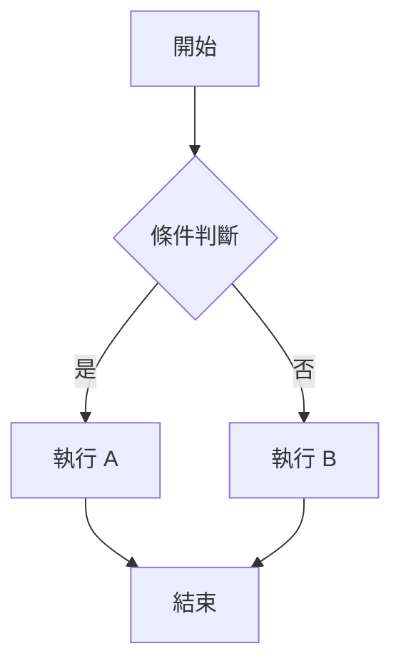

# Tech Insights - Hugo 多語言企業部落格模板

<p align="center">
  <strong>🌐 多語言支援 | 🎨 企業級設計 | ⚡ 高效能靜態網站</strong>
</p>

---

## � 目錄

- [專案簡介](#專案簡介)
- [功能特色](#功能特色)
- [快速開始](#快速開始)
- [專案結構](#專案結構)
- [配置指南](#配置指南)
  - [基本設定](#基本設定)
  - [多語言配置](#多語言配置)
  - [Hero 輪播設定](#hero-輪播設定)
  - [分類區塊設定](#分類區塊設定)
  - [電子報設定](#電子報設定)
  - [頁尾與社群連結](#頁尾與社群連結)
- [內容管理](#內容管理)
  - [建立文章](#建立文章)
  - [建立新聞](#建立新聞)
  - [Front Matter 欄位說明](#front-matter-欄位說明)
  - [Markdown 進階功能](#markdown-進階功能)
- [多語言內容](#多語言內容)
- [自訂樣式](#自訂樣式)
  - [設計系統變數](#設計系統變數)
  - [深色模式](#深色模式)
  - [字型設定](#字型設定)
- [版面自訂](#版面自訂)
- [部署指南](#部署指南)
- [常用指令](#常用指令)
- [疑難排解](#疑難排解)
- [授權](#授權)

---

## 專案簡介

Tech Insights 是一個基於 [Hugo](https://gohugo.io/) 建立的現代化多語言企業部落格模板。採用企業級設計系統，提供專業、簡潔的視覺體驗，適合科技公司、開發者社群、技術部落格等場景使用。

### 設計理念

- **企業級專業風格**：採用 Inter、Lora、Space Mono 字型組合，搭配精心設計的色彩系統
- **響應式設計**：完美支援桌面、平板、手機等各種裝置
- **效能優先**：靜態網站架構，載入速度極快
- **SEO 友善**：內建 sitemap、robots.txt、Open Graph 標籤等 SEO 最佳化

---

## 功能特色

### 🌐 完整多語言支援
- 內建英文 (en)、繁體中文 (zh-TW)、簡體中文 (zh-CN)
- 可輕鬆擴充其他語言
- 自動語言切換器
- 各語言獨立內容管理

### 🎠 動態 Hero 輪播
- 自動從 `news` 目錄讀取最新文章
- 支援手動配置靜態輪播內容
- 自動播放與手動控制
- 響應式全寬背景圖片

### 📝 豐富內容功能
- Markdown 完整支援
- Mermaid 圖表渲染
- KaTeX 數學公式
- 程式碼區塊語法高亮
- 一鍵複製程式碼

### 📖 優質閱讀體驗
- **Hero 風格封面** - 全寬背景圖片搭配標題覆蓋
- **閱讀進度條** - 頂部固定進度條顯示閱讀進度
- **首字母放大** - 雜誌風格的首字母放大效果
- **返回頂部按鈕** - 長文章快速返回頂部
- **優化排版間距** - 舒適的行高與段落間距

### 🎨 企業級設計系統
- CSS 變數設計 Token
- 深色/淺色模式支援
- 專業陰影與圓角設定
- 統一的動畫過渡效果

### 🔍 內建搜尋功能
- 即時客戶端搜尋
- 支援標題、內容、標籤搜尋
- 無需後端伺服器

### 📊 SEO 與分析
- 自動生成 sitemap.xml
- Open Graph / Twitter Card 支援
- Google Analytics 整合 (可選)
- 結構化資料支援

---

## 快速開始

### 前置需求

| 工具 | 版本需求 | 說明 |
|------|----------|------|
| [Hugo Extended](https://gohugo.io/installation/) | v0.112.0+ | 必須使用 Extended 版本 |
| [Git](https://git-scm.com/downloads) | 任意版本 | 用於主題子模組管理 |

### 安裝步驟

#### 方法一：從 Git Clone

```bash
# 1. Clone 專案
git clone https://github.com/your-username/hugo-japan.git
cd hugo-japan

# 2. 初始化主題子模組
git submodule update --init --recursive

# 3. 啟動開發伺服器
hugo server -D
```

#### 方法二：從壓縮檔解壓

```bash
# 1. 解壓縮
unzip hugo-japan.zip -d hugo-japan
cd hugo-japan

# 2. 初始化 Git 與主題
git init
git submodule add https://github.com/themefisher/parsa-hugo.git themes/parsa

# 3. 啟動開發伺服器
hugo server -D
```

#### Windows PowerShell

```powershell
# 解壓縮
Expand-Archive -Path hugo-japan.zip -DestinationPath .\hugo-japan
cd hugo-japan

# 初始化主題
git init
git submodule add https://github.com/themefisher/parsa-hugo.git themes/parsa

# 啟動伺服器
hugo server -D
```

成功啟動後，開啟瀏覽器訪問：**http://localhost:1313/**

---

## 專案結構

```
hugo-japan/
├── archetypes/              # 內容模板
│   └── default.md           # 預設文章模板
├── assets/
│   └── css/
│       └── custom.css       # 🎨 主要樣式檔（設計系統）
├── content/                 # 📝 多語言內容
│   ├── en/                  # 英文內容
│   │   ├── _index.md
│   │   ├── about.md
│   │   ├── news/            # 新聞文章（Hero 輪播來源）
│   │   └── posts/           # 部落格文章
│   ├── zh-TW/               # 繁體中文內容
│   └── zh-CN/               # 簡體中文內容
├── i18n/                    # 🌐 多語言翻譯檔
│   ├── en.toml
│   ├── zh-TW.toml
│   └── zh-CN.toml
├── layouts/                 # 📐 版面模板
│   ├── _default/
│   │   ├── baseof.html      # 基礎版面
│   │   ├── list.html        # 列表頁
│   │   ├── single.html      # 文章頁
│   │   ├── search.html      # 搜尋頁
│   │   └── archives.html    # 文章列表頁
│   ├── partials/
│   │   ├── header-custom.html
│   │   ├── footer-custom.html
│   │   ├── head.html
│   │   └── ...
│   ├── shortcodes/          # 短代碼
│   └── index.html           # 首頁模板
├── static/                  # 📁 靜態資源
│   └── images/
│       ├── logo.png
│       ├── hero-tech.jpg
│       └── posts/
├── themes/                  # 主題目錄
│   └── parsa/               # Parsa 主題（子模組）
└── hugo.toml                # ⚙️ 主配置檔
```


---

## 配置指南

所有網站配置都在 `hugo.toml` 檔案中進行。

### 基本設定

```toml
# 網站基本資訊
baseURL = 'https://your-domain.com/'
title = 'Your Site Name'
theme = 'parsa'

# 預設語言
defaultContentLanguage = 'en'
defaultContentLanguageInSubdir = false

# 啟用 SEO 功能
enableRobotsTXT = true
```

### 多語言配置

```toml
[languages]
  # 英文設定
  [languages.en]
    contentDir = 'content/en'
    languageCode = 'en-US'
    languageName = 'English'
    weight = 1                    # 排序權重（數字越小越前面）
    title = 'Tech Insights'
    [languages.en.params]
      description = 'Your site description in English'

      # 關於區塊（各語言獨立設定）
      [languages.en.params.about_section]
        enable = true
        title = "About Us"
        subtitle = "Our mission"
        content = "Your about content..."
        image = "images/about-tech.jpg"
        button_text = "Learn More"
        button_link = "/about/"

  # 繁體中文設定
  [languages.zh-TW]
    contentDir = 'content/zh-TW'
    languageCode = 'zh-TW'
    languageName = '繁體中文'
    weight = 2
    title = '科技洞察'
    [languages.zh-TW.params]
      description = '您的網站描述'
```

### Hero 輪播設定

Hero 輪播預設會自動從各語系的 `news` 目錄讀取最新 5 篇文章。您也可以在配置檔中手動設定靜態輪播內容作為備用：

```toml
[params.hero]
  enable = true
  autoplay_interval = 6000      # 自動播放間隔（毫秒），0 = 停用

# 靜態輪播內容（當 news 目錄無文章時使用）
[[params.hero.slides]]
  image = "images/hero-tech.jpg"           # 背景圖片
  badge = "Latest Tech Trends"              # 左上角標籤
  title = "Explore the <span class='ti-hero-title-highlight'>Future</span>"
  subtitle = "Your subtitle description here"
  primary_button_text = "Get Started"
  primary_button_link = "#articles"
  secondary_button_text = "Learn More"
  secondary_button_link = "#about"

[[params.hero.slides]]
  image = "images/hero-ai.jpg"
  badge = "AI & ML"
  title = "Master <span class='ti-hero-title-highlight'>AI</span>"
  subtitle = "Deep learning tutorials and more"
  primary_button_text = "View Articles"
  primary_button_link = "/categories/ai/"
```

> 💡 **提示**：使用 `<span class='ti-hero-title-highlight'>` 可以讓標題中的特定文字有高亮效果。

### 分類區塊設定

```toml
[params.categories_section]
  enable = true
  title = "Explore Topics"
  subtitle = "Browse by category"

[[params.categories_section.items]]
  name = "Artificial Intelligence"
  icon = "brain"                 # 圖標名稱：brain, code, cloud, smartphone, shield, database
  color = "ai"                   # 顏色類別：ai, web, cloud, mobile, security, data
  count = 45                     # 文章數量
  slug = "ai"                    # URL slug

[[params.categories_section.items]]
  name = "Web Development"
  icon = "code"
  color = "web"
  count = 67
  slug = "web-development"
```

### 電子報設定

```toml
[params.newsletter]
  enable = true
  title = "Subscribe to Our Newsletter"
  subtitle = "Get the latest articles delivered to your inbox"
  placeholder = "Enter your email"
  button = "Subscribe Now"
  disclaimer = "We respect your privacy"
```

### 頁尾與社群連結

```toml
[params.footer]
  copyright = "© 2024 Your Company. All rights reserved."
  description = "Your footer description"

# 頁尾連結群組
[[params.footer.about]]
  label = "About Us"
  url = "/about/"

[[params.footer.resources]]
  label = "All Articles"
  url = "/posts/"

[[params.footer.legal]]
  label = "Privacy Policy"
  url = "/privacy/"

# 社群連結
[[params.social]]
  icon = "github"                # 支援：github, twitter, linkedin, mail
  link = "https://github.com/your-username"
  label = "GitHub"

[[params.social]]
  icon = "twitter"
  link = "https://twitter.com/your-handle"
  label = "Twitter"
```

### 分析與追蹤（可選）

```toml
[params]
  # Google Analytics (GA4)
  google_analytics = 'G-XXXXXXXXXX'

  # Facebook Pixel
  facebook_pixel = 'XXXXXXXXXXXXXXX'

  # Google AdSense
  google_adsense = 'ca-pub-XXXXXXXXXXXXXXXX'
```

### 主題 Plugins 設定

本專案使用 Parsa 主題，需要載入主題提供的 CSS/JS plugins。這些設定**已預先配置**在 `hugo.toml` 中：

```toml
# CSS Plugins（主題提供）
[[params.plugins.css]]
  link = "plugins/bootstrap/bootstrap.min.css"
[[params.plugins.css]]
  link = "plugins/slick/slick.css"
[[params.plugins.css]]
  link = "plugins/themify-icons/themify-icons.css"

# JS Plugins（主題提供）
[[params.plugins.js]]
  link = "plugins/jQuery/jquery.min.js"
[[params.plugins.js]]
  link = "plugins/bootstrap/bootstrap.min.js"
[[params.plugins.js]]
  link = "plugins/slick/slick.min.js"
[[params.plugins.js]]
  link = "plugins/headroom/headroom.js"
[[params.plugins.js]]
  link = "plugins/masonry/masonry.js"
[[params.plugins.js]]
  link = "plugins/reading-time/readingTime.min.js"
[[params.plugins.js]]
  link = "plugins/smooth-scroll/smooth-scroll.js"
[[params.plugins.js]]
  link = "plugins/search/fuse.min.js"
[[params.plugins.js]]
  link = "plugins/search/mark.js"
[[params.plugins.js]]
  link = "plugins/search/search.js"
```

> ⚠️ **重要**：這些 plugins 是主題正常運作所必需的。請勿刪除這些設定，否則會導致 JavaScript 錯誤。

---

## 內容管理

### 建立文章

文章放在各語系的 `posts` 目錄下：

```bash
# 建立英文文章
hugo new posts/my-new-article.md

# 或直接在對應目錄建立
# content/en/posts/my-new-article.md
# content/zh-TW/posts/my-new-article.md
```

### 建立新聞

新聞文章會自動顯示在首頁 Hero 輪播中：

```bash
# 在 news 目錄建立新聞
# content/en/news/breaking-news.md
# content/zh-TW/news/breaking-news.md
```

### Front Matter 欄位說明

#### 完整範例

```yaml
---
title: "文章標題"
date: 2024-01-15T10:00:00+08:00
lastmod: 2024-01-20T15:30:00+08:00
draft: false
type: post                        # post 或 news
description: "文章描述，用於 SEO 和摘要"
categories:
  - Tutorial
  - AI
tags:
  - Hugo
  - Markdown
  - Web Development
author: "作者名稱"
image: "images/posts/cover.jpg"   # 封面圖片
mermaid: true                     # 啟用 Mermaid 圖表
math: true                        # 啟用 KaTeX 數學公式
featured: true                    # 精選文章（news 專用）
---
```

#### 欄位說明表

| 欄位 | 必填 | 說明 |
|------|------|------|
| `title` | ✅ | 文章標題 |
| `date` | ✅ | 發布日期 (ISO 8601 格式) |
| `lastmod` | ❌ | 最後修改日期 |
| `draft` | ❌ | 是否為草稿 (true/false) |
| `type` | ❌ | 內容類型 (post/news) |
| `description` | 建議 | SEO 描述，約 150-160 字元 |
| `categories` | 建議 | 分類列表 |
| `tags` | 建議 | 標籤列表 |
| `author` | ❌ | 作者名稱 |
| `image` | 建議 | 封面圖片路徑 |
| `mermaid` | ❌ | 啟用 Mermaid 圖表 |
| `math` | ❌ | 啟用 KaTeX 數學公式 |
| `featured` | ❌ | 精選標記 |

### Markdown 進階功能

#### 程式碼區塊

支援語法高亮與一鍵複製：

````markdown
```javascript
function hello() {
  console.log("Hello, World!");
}
```
````

#### Mermaid 圖表

在 Front Matter 中設定 `mermaid: true` 後：

````markdown

````

#### KaTeX 數學公式

在 Front Matter 中設定 `math: true` 後：

```markdown
行內公式：$E = mc^2$

區塊公式：
$$
\int_{-\infty}^{\infty} e^{-x^2} dx = \sqrt{\pi}
$$
```

#### 摘要分隔符

使用 `<!--more-->` 標記摘要結束位置：

```markdown
這是文章摘要，會顯示在列表頁。

<!--more-->

這是文章正文，只在文章頁顯示。
```

---

## 多語言內容

### 目錄結構

每個語言都有獨立的內容目錄：

```
content/
├── en/                    # 英文
│   ├── _index.md
│   ├── about.md
│   ├── posts/
│   └── news/
├── zh-TW/                 # 繁體中文
│   ├── _index.md
│   ├── about.md
│   ├── posts/
│   └── news/
└── zh-CN/                 # 簡體中文
    ├── _index.md
    ├── about.md
    ├── posts/
    └── news/
```

### 翻譯字串

UI 翻譯字串在 `i18n/` 目錄：

```toml
# i18n/zh-TW.toml
[read_more]
other = "閱讀更多"

[search]
other = "搜尋"

[categories]
other = "分類"
```

### 新增語言

1. 在 `hugo.toml` 中新增語言配置
2. 建立對應的內容目錄 `content/新語言代碼/`
3. 建立翻譯檔 `i18n/新語言代碼.toml`

---

## 自訂樣式

### 設計系統變數

所有樣式變數定義在 `assets/css/custom.css`：

```css
:root {
  /* 主色系 (HSL) */
  --ti-primary: 0 76% 44%;           /* 企業紅 */
  --ti-primary-foreground: 0 0% 100%;

  /* 背景色 */
  --ti-background: 0 0% 100%;
  --ti-foreground: 0 0% 13%;

  /* 卡片 */
  --ti-card: 0 0% 100%;
  --ti-card-foreground: 0 0% 13%;

  /* 邊框 */
  --ti-border: 212 26% 83%;

  /* 陰影 */
  --ti-shadow-soft: 0 1px 3px 0 hsl(0 0% 0% / 0.1);
  --ti-shadow-card: 0 4px 6px -1px hsl(0 0% 0% / 0.1);

  /* 圓角 */
  --ti-radius: 0.5rem;
  --ti-radius-sm: 0.375rem;
  --ti-radius-lg: 0.75rem;

  /* 動畫 */
  --ti-transition: all 0.3s ease;
}
```

### 深色模式

深色模式樣式自動應用於 `.dark` 類別：

```css
.dark {
  --ti-background: 222 47% 11%;
  --ti-foreground: 210 40% 98%;
  --ti-primary: 198 93% 59%;
  --ti-card: 217 32% 17%;
  /* ... */
}
```

### 字型設定

預設使用三種 Google 字型：

| 字型 | 用途 | CSS 變數 |
|------|------|----------|
| Inter | 正文、UI | `--ti-font-sans` |
| Lora | 標題、強調 | `--ti-font-serif` |
| Space Mono | 程式碼 | `--ti-font-mono` |

修改字型：

```css
:root {
  --ti-font-sans: 'Your Font', system-ui, sans-serif;
}
```

### 文章內圖片大小

文章內容中的圖片會自動限制最大高度，確保版面整齊：

```css
/* 在 layouts/_default/single.html 中定義 */
.ti-post-body img {
    max-width: 100%;
    max-height: 400px;    /* 圖片最大高度 */
    width: auto;
    height: auto;
    object-fit: contain;  /* 保持比例縮放 */
    border-radius: var(--ti-radius);
    margin: 2rem auto;
    display: block;
}
```

如需調整圖片最大高度，修改 `max-height` 的值即可。

---

## 版面自訂

### 主要版面檔案

| 檔案 | 說明 |
|------|------|
| `layouts/index.html` | 首頁（Hero、分類、文章列表、電子報） |
| `layouts/_default/single.html` | 文章詳細頁 |
| `layouts/_default/list.html` | 列表頁（分類、標籤） |
| `layouts/_default/search.html` | 搜尋頁 |
| `layouts/_default/archives.html` | 文章列表頁 |
| `layouts/partials/header-custom.html` | 頁首導航 |
| `layouts/partials/footer-custom.html` | 頁尾 |

### 修改首頁區塊

編輯 `layouts/index.html` 可自訂首頁區塊順序與內容。

### 文章頁面閱讀體驗

文章頁面 (`layouts/_default/single.html`) 包含以下增強功能：

#### Hero 風格封面

當文章設定 `image` 時，封面圖片會作為全寬背景顯示，標題覆蓋其上：

```yaml
---
title: "文章標題"
image: "images/posts/cover.jpg"  # 會成為 Hero 背景
---
```

#### 閱讀進度條

頂部固定的進度條會隨著滾動顯示閱讀進度，讓讀者知道閱讀位置。

#### 首字母放大效果

文章第一段的首字母會自動放大，營造雜誌風格的閱讀體驗。

#### 返回頂部按鈕

當滾動超過 500px 時，右下角會出現返回頂部按鈕。

#### 自訂閱讀體驗

修改 `layouts/_default/single.html` 中的 CSS 變數：

```css
/* 調整首字母放大大小 */
.ti-post-body > p:first-of-type::first-letter {
    font-size: 4rem;  /* 預設 4rem */
}

/* 調整進度條顏色 */
.ti-reading-progress {
    background: linear-gradient(90deg, hsl(var(--ti-primary)), hsl(var(--ti-primary) / 0.7));
}

/* 調整文章內容寬度 */
.ti-post-body {
    max-width: 720px;  /* 預設 720px */
}
```

---

## 部署指南

### 建構生產版本

```bash
# 建構靜態網站
hugo

# 輸出目錄
ls public/
```

### 部署到各平台

#### Netlify

1. 連結 Git 儲存庫
2. 建構指令：`hugo`
3. 發布目錄：`public`
4. 環境變數：`HUGO_VERSION = 0.120.0`

#### Vercel

1. 連結 Git 儲存庫
2. Framework Preset：Hugo
3. 建構指令：`hugo`
4. 輸出目錄：`public`

#### GitHub Pages

```yaml
# .github/workflows/hugo.yml
name: Deploy Hugo site

on:
  push:
    branches: [main]

jobs:
  build-deploy:
    runs-on: ubuntu-latest
    steps:
      - uses: actions/checkout@v4
        with:
          submodules: recursive

      - name: Setup Hugo
        uses: peaceiris/actions-hugo@v2
        with:
          hugo-version: 'latest'
          extended: true

      - name: Build
        run: hugo --minify

      - name: Deploy
        uses: peaceiris/actions-gh-pages@v3
        with:
          github_token: ${{ secrets.GITHUB_TOKEN }}
          publish_dir: ./public
```

#### 自架伺服器

```bash
# 建構
hugo

# 複製到網站根目錄
rsync -avz public/ user@server:/var/www/html/
```

---

## 常用指令

| 指令 | 說明 |
|------|------|
| `hugo server` | 啟動開發伺服器 |
| `hugo server -D` | 啟動開發伺服器（包含草稿） |
| `hugo server --bind 0.0.0.0` | 允許區網存取 |
| `hugo` | 建構生產版本 |
| `hugo --minify` | 建構並壓縮 |
| `hugo new posts/文章名稱.md` | 建立新文章 |
| `hugo --gc --cleanDestinationDir` | 清理並重新建構 |

---

## 疑難排解

### 主題載入失敗

```bash
# 檢查主題目錄
ls themes/parsa

# 重新初始化子模組
git submodule update --init --recursive
```

### Hugo 版本問題

必須使用 **Extended** 版本：

```bash
hugo version
# 應顯示 "extended"，例如：hugo v0.120.0+extended
```

### 圖片無法顯示

確認圖片路徑正確：
- 靜態圖片放在 `static/images/`
- Front Matter 中使用相對路徑：`image: "images/posts/cover.jpg"`

### 多語言切換問題

確認各語言內容目錄結構一致，並且 `hugo.toml` 中的 `contentDir` 設定正確。

### Mermaid/KaTeX 不渲染

確認 Front Matter 中已啟用：

```yaml
---
mermaid: true
math: true
---
```

---

## 授權

本專案使用 [MIT License](LICENSE)。

---

<p align="center">
  <strong>Made with ❤️ using Hugo</strong>
</p>