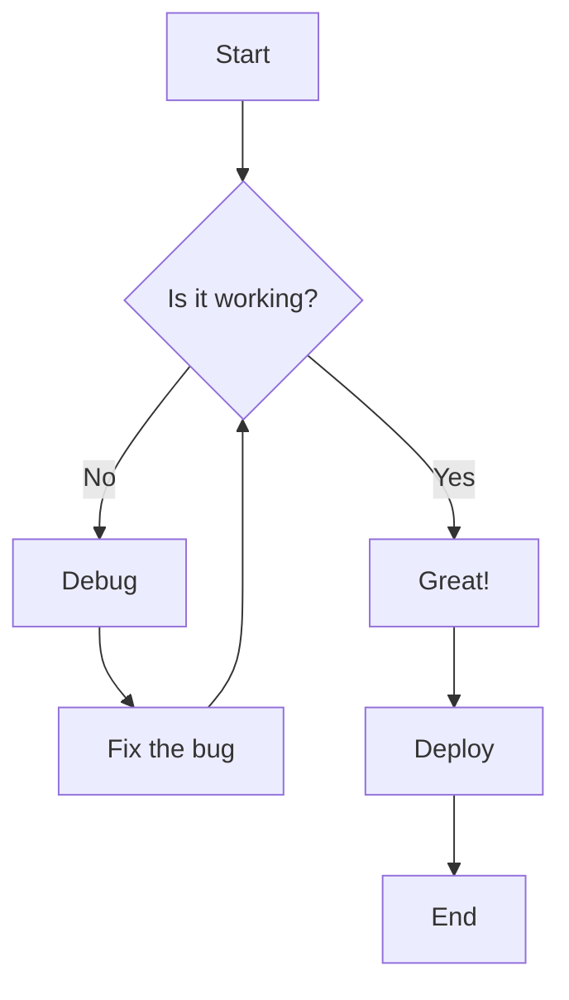
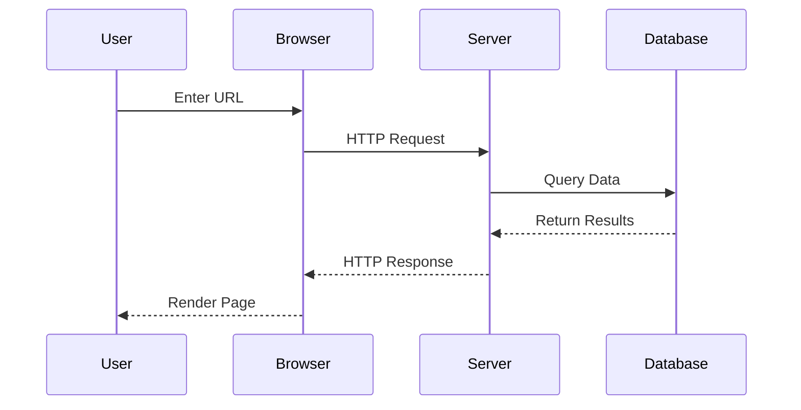
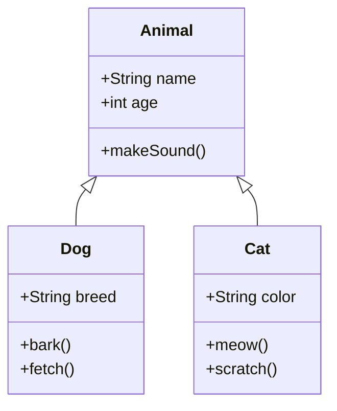
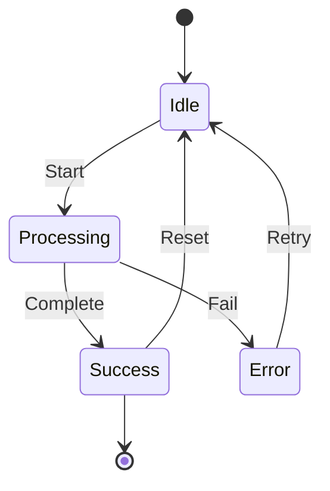
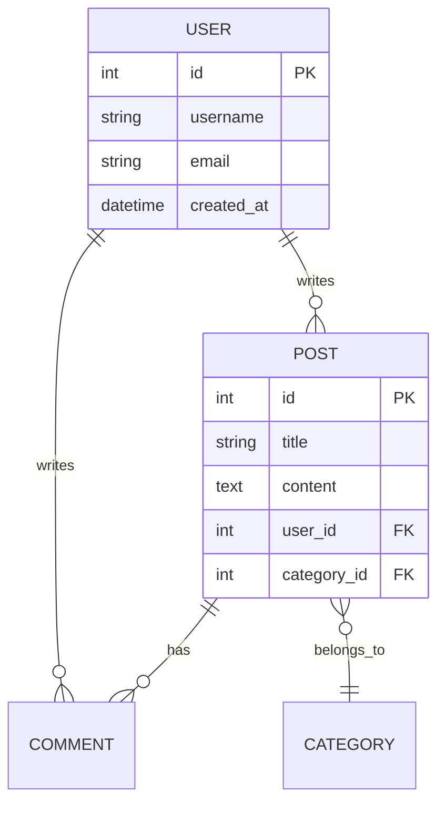
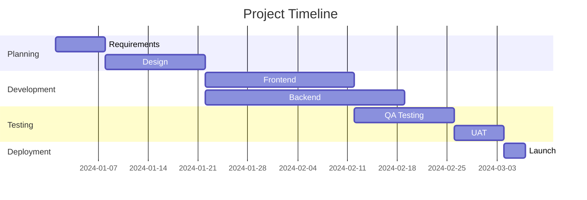
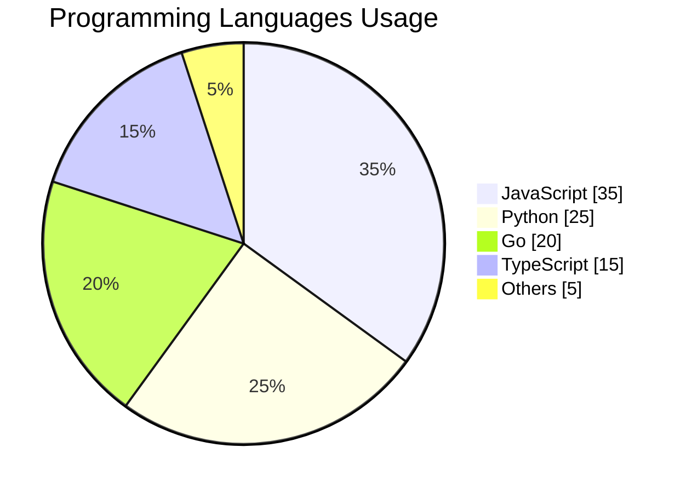
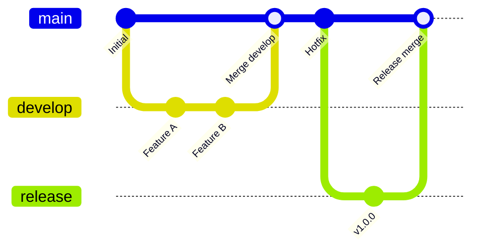
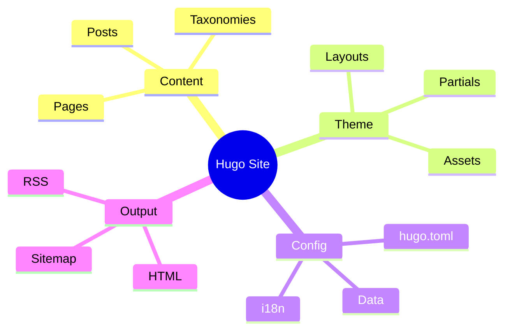

This article demonstrates all Markdown features supported by this Hugo template, including extended syntax, code blocks, diagrams, and mathematical equations.

<!--more-->

---

## Heading Levels

# Heading 1
## Heading 2
### Heading 3
#### Heading 4
##### Heading 5
###### Heading 6

---

## Text Formatting

This is **bold text** and this is *italic text*.

This is ***bold and italic*** combined.

This is ~~strikethrough~~ text.

This is `inline code` within a sentence.

> This is a blockquote. It can span multiple lines and is often used for citations or highlighting important information.
>
> — Author Name

### Nested Blockquote

> First level quote
>> Second level quote
>>> Third level quote

---

## Lists

### Unordered List

- Item 1
- Item 2
  - Nested item 2.1
  - Nested item 2.2
    - Deep nested item
- Item 3

### Ordered List

1. First item
2. Second item
   1. Sub-item 2.1
   2. Sub-item 2.2
3. Third item

### Task List

- [x] Completed task
- [x] Another completed task
- [ ] Pending task
- [ ] Future task

---

## Links and Images

### Links

- [External Link](https://gohugo.io/)
- [Link with Title](https://gohugo.io/ "Hugo Official Website")
- <https://gohugo.io/> (Auto-linked URL)
- Contact: <hello@example.com>

### Images


*Figure 1: Hugo Logo*

---

## Tables

### Basic Table

| Header 1 | Header 2 | Header 3 |
|----------|----------|----------|
| Cell 1   | Cell 2   | Cell 3   |
| Cell 4   | Cell 5   | Cell 6   |
| Cell 7   | Cell 8   | Cell 9   |

### Aligned Table

| Left Aligned | Center Aligned | Right Aligned |
|:-------------|:--------------:|--------------:|
| Text         | Text           | Text          |
| More text    | More text      | More text     |
| Even more    | Even more      | 1,234.56      |

### Complex Table

| Feature | Free Plan | Pro Plan | Enterprise |
|:--------|:---------:|:--------:|:----------:|
| Users | 5 | 50 | Unlimited |
| Storage | 1 GB | 100 GB | 1 TB |
| Support | Email | Priority | 24/7 |
| Price | $0 | $29/mo | Custom |

---

## Code Blocks

### Inline Code

Use the `hugo server` command to start the development server.

### JavaScript

```javascript
/**
 * Calculates the factorial of a number
 * @param {number} n - The input number
 * @returns {number} The factorial result
 */
function factorial(n) {
  if (n <= 1) return 1;
  return n * factorial(n - 1);
}

// Example usage
const result = factorial(5);
console.log(`5! = ${result}`); // Output: 5! = 120
```

### Python

```python
from typing import List, Optional

class DataProcessor:
    """A class for processing data with various transformations."""
    
    def __init__(self, data: List[int]):
        self.data = data
    
    def filter_positive(self) -> List[int]:
        """Filter and return only positive numbers."""
        return [x for x in self.data if x > 0]
    
    def calculate_average(self) -> Optional[float]:
        """Calculate the average of all numbers."""
        if not self.data:
            return None
        return sum(self.data) / len(self.data)

# Example usage
processor = DataProcessor([1, -2, 3, -4, 5])
print(f"Positive numbers: {processor.filter_positive()}")
print(f"Average: {processor.calculate_average()}")
```

### Go

```go
package main

import (
    "fmt"
    "sync"
)

// SafeCounter is a thread-safe counter
type SafeCounter struct {
    mu    sync.Mutex
    count int
}

// Increment increases the counter by 1
func (c *SafeCounter) Increment() {
    c.mu.Lock()
    defer c.mu.Unlock()
    c.count++
}

// Value returns the current count
func (c *SafeCounter) Value() int {
    c.mu.Lock()
    defer c.mu.Unlock()
    return c.count
}

func main() {
    counter := &SafeCounter{}
    
    var wg sync.WaitGroup
    for i := 0; i < 1000; i++ {
        wg.Add(1)
        go func() {
            defer wg.Done()
            counter.Increment()
        }()
    }
    
    wg.Wait()
    fmt.Printf("Final count: %d\n", counter.Value())
}
```

### Shell / Bash

```bash
#!/bin/bash

# Hugo site deployment script
set -e

echo "🚀 Starting deployment..."

# Build the site
hugo --minify

# Deploy to server
rsync -avz --delete public/ user@server:/var/www/html/

echo "✅ Deployment complete!"
```

### HTML

```html
<!DOCTYPE html>
<html lang="en">
<head>
    <meta charset="UTF-8">
    <meta name="viewport" content="width=device-width, initial-scale=1.0">
    <title>Sample Page</title>
</head>
<body>
    <header>
        <h1>Welcome</h1>
        <nav>
            <a href="/">Home</a>
            <a href="/about">About</a>
        </nav>
    </header>
    <main>
        <p>Content goes here.</p>
    </main>
</body>
</html>
```

### CSS

```css
/* Modern CSS Variables and Styling */
:root {
    --primary-color: #3498db;
    --secondary-color: #2ecc71;
    --font-family: 'Inter', sans-serif;
}

.container {
    max-width: 1200px;
    margin: 0 auto;
    padding: 2rem;
}

.card {
    background: white;
    border-radius: 8px;
    box-shadow: 0 2px 10px rgba(0, 0, 0, 0.1);
    transition: transform 0.3s ease;
}

.card:hover {
    transform: translateY(-5px);
}
```

### SQL

```sql
-- Create users table
CREATE TABLE users (
    id SERIAL PRIMARY KEY,
    username VARCHAR(50) NOT NULL UNIQUE,
    email VARCHAR(100) NOT NULL UNIQUE,
    created_at TIMESTAMP DEFAULT CURRENT_TIMESTAMP
);

-- Query with JOIN
SELECT 
    u.username,
    COUNT(p.id) AS post_count
FROM users u
LEFT JOIN posts p ON u.id = p.user_id
GROUP BY u.id
HAVING COUNT(p.id) > 5
ORDER BY post_count DESC;
```

### JSON

```json
{
  "name": "my-hugo-site",
  "version": "1.0.0",
  "config": {
    "theme": "parsa",
    "languages": ["en", "zh-CN", "zh-TW"],
    "features": {
      "mermaid": true,
      "math": true,
      "analytics": true
    }
  }
}
```

### YAML

```yaml
# Hugo configuration
baseURL: https://example.org/
title: My Hugo Site
theme: parsa

languages:
  en:
    languageName: English
    weight: 1
  zh-TW:
    languageName: 繁體中文
    weight: 2

params:
  description: A modern Hugo blog
  author: Your Name
```

### Diff

```diff
- const oldFunction = () => {
-   return "old";
- };
+ const newFunction = () => {
+   return "new and improved";
+ };
```

---

## Mermaid Diagrams

### Flowchart



### Sequence Diagram



### Class Diagram



### State Diagram



### Entity Relationship Diagram



### Gantt Chart



### Pie Chart



### Git Graph



### Mind Map



---

## YouTube Video Embed

Here's an embedded YouTube video demonstrating responsive design:



You can also specify a title and start time:



---

## Mathematical Equations

### Inline Math

The famous equation $E = mc^2$ changed physics forever.

The quadratic formula is $x = \frac{-b \pm \sqrt{b^2 - 4ac}}{2a}$.

### Display Math (Block)

$$
\int_{-\infty}^{\infty} e^{-x^2} dx = \sqrt{\pi}
$$

### System of Equations

$$
\begin{cases}
3x + 2y - z = 1 \\
2x - 2y + 4z = -2 \\
-x + \frac{1}{2}y - z = 0
\end{cases}
$$

### Matrix

$$
\mathbf{A} = \begin{pmatrix}
a_{11} & a_{12} & a_{13} \\
a_{21} & a_{22} & a_{23} \\
a_{31} & a_{32} & a_{33}
\end{pmatrix}
$$

### Summation and Product

$$
\sum_{i=1}^{n} i = \frac{n(n+1)}{2}
$$

$$
\prod_{i=1}^{n} i = n!
$$

### Limit and Derivative

$$
\lim_{x \to 0} \frac{\sin x}{x} = 1
$$

$$
\frac{d}{dx}\left( x^n \right) = nx^{n-1}
$$

### Complex Equation

The Schrödinger equation:

$$
i\hbar\frac{\partial}{\partial t}\Psi(\mathbf{r},t) = \left[ -\frac{\hbar^2}{2m}\nabla^2 + V(\mathbf{r},t) \right]\Psi(\mathbf{r},t)
$$

### Maxwell's Equations

$$
\begin{aligned}
\nabla \cdot \mathbf{E} &= \frac{\rho}{\varepsilon_0} \\
\nabla \cdot \mathbf{B} &= 0 \\
\nabla \times \mathbf{E} &= -\frac{\partial \mathbf{B}}{\partial t} \\
\nabla \times \mathbf{B} &= \mu_0\mathbf{J} + \mu_0\varepsilon_0\frac{\partial \mathbf{E}}{\partial t}
\end{aligned}
$$

---

## Footnotes

Here is a sentence with a footnote[^1].

And another one with a different footnote[^2].

[^1]: This is the first footnote.
[^2]: This is the second footnote with more details.

---

## Definition List

Hugo
: A fast and modern static site generator written in Go.

Markdown
: A lightweight markup language for creating formatted text.

Mermaid
: A JavaScript-based diagramming and charting tool.

---

## Abbreviations

The HTML specification is maintained by the W3C.

*[HTML]: Hyper Text Markup Language
*[W3C]: World Wide Web Consortium

---

## Horizontal Rules

Three or more dashes, asterisks, or underscores:

---

***

___

---

## Keyboard Keys

Press <kbd>Ctrl</kbd> + <kbd>C</kbd> to copy.

Press <kbd>Cmd</kbd> + <kbd>Shift</kbd> + <kbd>P</kbd> to open the command palette.

---

## Highlighted Text

This is <mark>highlighted text</mark> for emphasis.

---

## Subscript and Superscript

- Water: H<sub>2</sub>O
- E = mc<sup>2</sup>
- x<sup>2</sup> + y<sup>2</sup> = z<sup>2</sup>

---

## Emoji (if supported)

- 🚀 Rocket
- ✨ Sparkles
- 📝 Writing
- 💻 Laptop
- 🎉 Celebration

---

## Summary

This article covered:

1. **Basic Markdown** - Headings, text formatting, lists
2. **Extended Syntax** - Tables, task lists, footnotes
3. **Code Blocks** - Multiple language support with syntax highlighting
4. **Mermaid Diagrams** - Flowcharts, sequence diagrams, Gantt charts, and more
5. **YouTube Embeds** - Responsive video embedding
6. **Mathematical Equations** - KaTeX support for complex formulas

Feel free to use this as a reference when writing your own articles!
