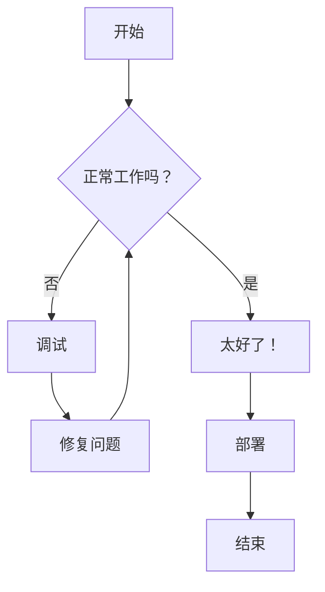
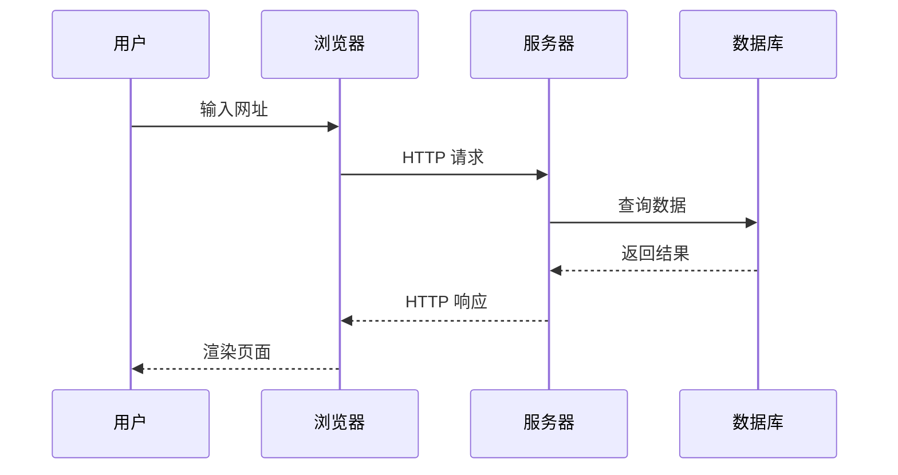
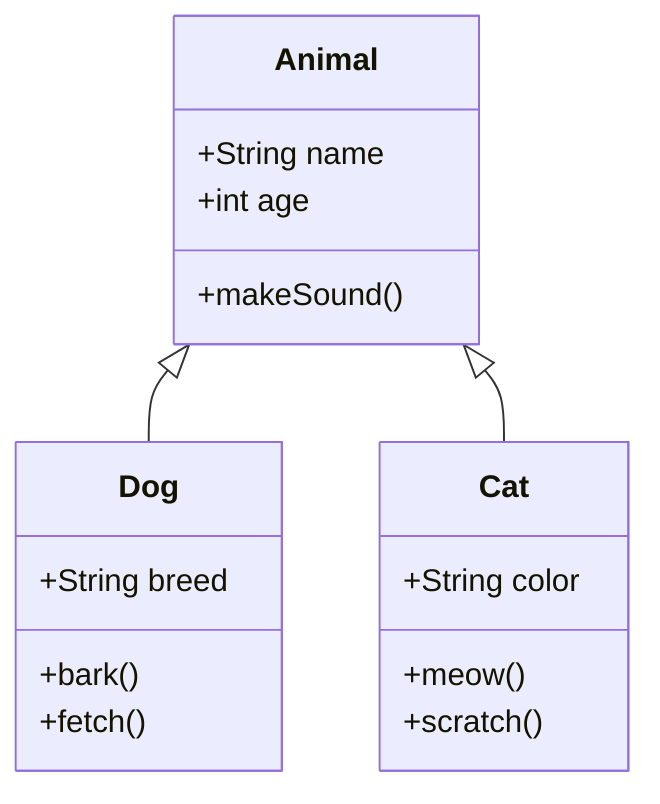
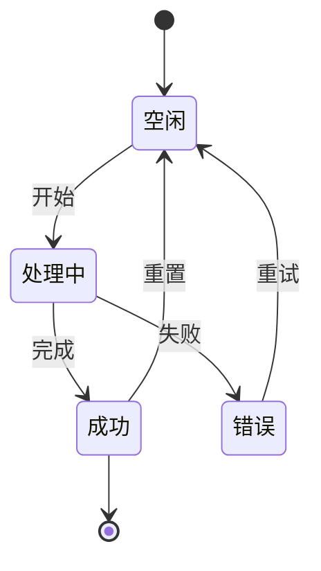
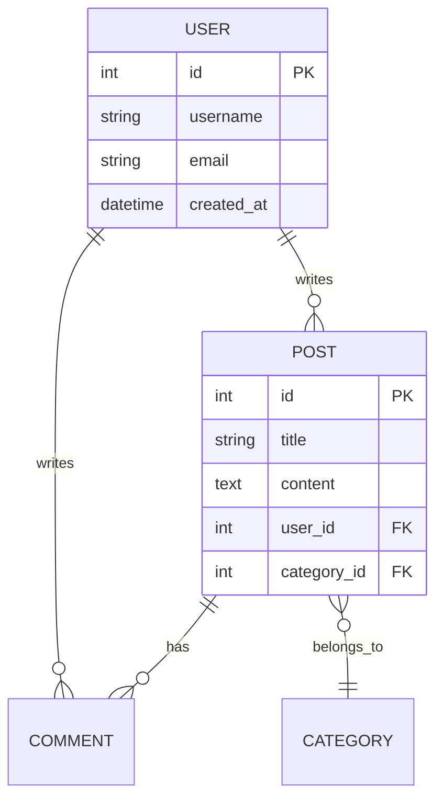
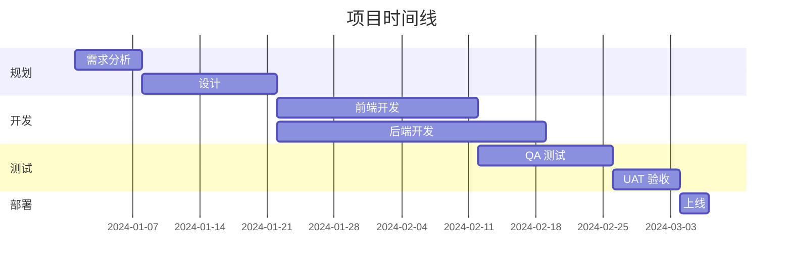
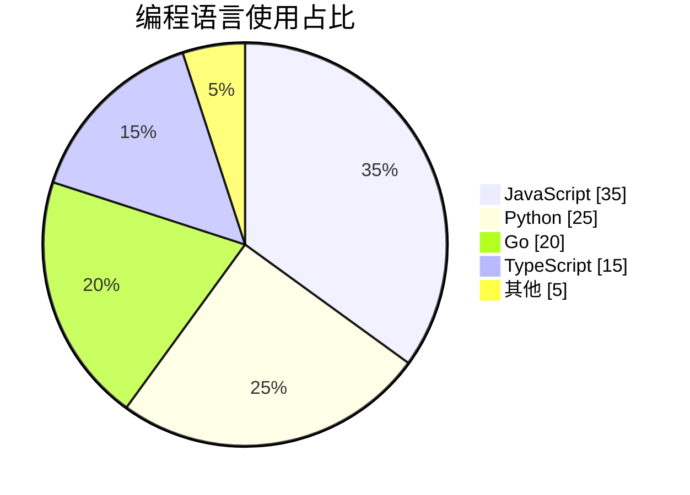
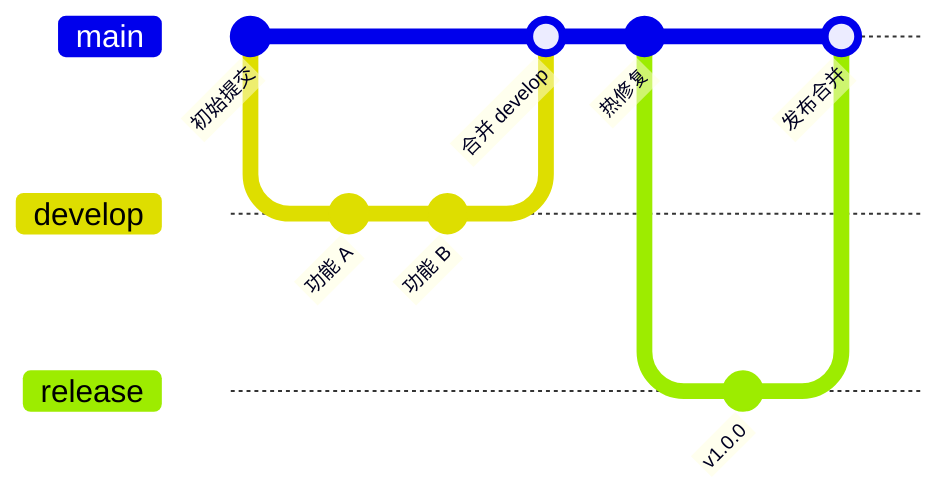
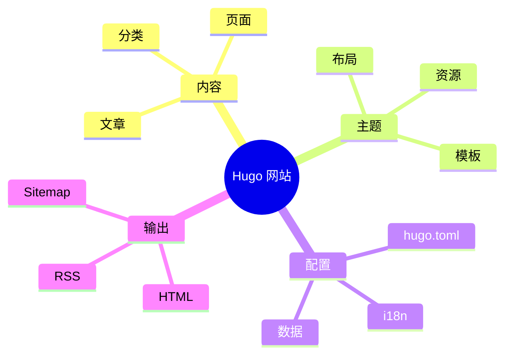

本文展示了此 Hugo 模板支持的所有 Markdown 功能，包括扩展语法、代码块、图表和数学公式。

<!--more-->

---

## 标题层级

# 一级标题
## 二级标题
### 三级标题
#### 四级标题
##### 五级标题
###### 六级标题

---

## 文本格式

这是**粗体文本**，这是*斜体文本*。

这是***粗体加斜体***的组合。

这是~~删除线~~文本。

这是句子中的`行内代码`。

> 这是一段引用文本。它可以跨越多行，通常用于引用或突出重要信息。
>
> — 作者名称

### 嵌套引用

> 第一层引用
>> 第二层引用
>>> 第三层引用

---

## 列表

### 无序列表

- 项目 1
- 项目 2
  - 嵌套项目 2.1
  - 嵌套项目 2.2
    - 深层嵌套项目
- 项目 3

### 有序列表

1. 第一项
2. 第二项
   1. 子项 2.1
   2. 子项 2.2
3. 第三项

### 任务列表

- [x] 已完成任务
- [x] 另一个已完成任务
- [ ] 待处理任务
- [ ] 未来任务

---

## 链接与图片

### 链接

- [外部链接](https://gohugo.io/)
- [带标题的链接](https://gohugo.io/ "Hugo 官方网站")
- <https://gohugo.io/>（自动链接）
- 联系方式：<hello@example.com>

### 图片


*图 1：Hugo Logo*

---

## 表格

### 基本表格

| 表头 1 | 表头 2 | 表头 3 |
|--------|--------|--------|
| 单元格 1 | 单元格 2 | 单元格 3 |
| 单元格 4 | 单元格 5 | 单元格 6 |
| 单元格 7 | 单元格 8 | 单元格 9 |

### 对齐表格

| 左对齐 | 居中对齐 | 右对齐 |
|:-------|:--------:|-------:|
| 文本   | 文本     | 文本   |
| 更多文本 | 更多文本 | 更多文本 |
| 还有更多 | 还有更多 | 1,234.56 |

### 复杂表格

| 功能 | 免费版 | 专业版 | 企业版 |
|:-----|:------:|:------:|:------:|
| 用户数 | 5 | 50 | 无限制 |
| 存储空间 | 1 GB | 100 GB | 1 TB |
| 技术支持 | 邮件 | 优先 | 7×24 |
| 价格 | ¥0 | ¥199/月 | 定制 |

---

## 代码块

### 行内代码

使用 `hugo server` 命令启动开发服务器。

### JavaScript

```javascript
/**
 * 计算数字的阶乘
 * @param {number} n - 输入数字
 * @returns {number} 阶乘结果
 */
function factorial(n) {
  if (n <= 1) return 1;
  return n * factorial(n - 1);
}

// 使用示例
const result = factorial(5);
console.log(`5! = ${result}`); // 输出: 5! = 120
```

### Python

```python
from typing import List, Optional

class DataProcessor:
    """用于处理数据的类，支持各种转换操作。"""
    
    def __init__(self, data: List[int]):
        self.data = data
    
    def filter_positive(self) -> List[int]:
        """过滤并返回正数。"""
        return [x for x in self.data if x > 0]
    
    def calculate_average(self) -> Optional[float]:
        """计算所有数字的平均值。"""
        if not self.data:
            return None
        return sum(self.data) / len(self.data)

# 使用示例
processor = DataProcessor([1, -2, 3, -4, 5])
print(f"正数: {processor.filter_positive()}")
print(f"平均值: {processor.calculate_average()}")
```

### Go

```go
package main

import (
    "fmt"
    "sync"
)

// SafeCounter 是线程安全的计数器
type SafeCounter struct {
    mu    sync.Mutex
    count int
}

// Increment 将计数器加 1
func (c *SafeCounter) Increment() {
    c.mu.Lock()
    defer c.mu.Unlock()
    c.count++
}

// Value 返回当前计数
func (c *SafeCounter) Value() int {
    c.mu.Lock()
    defer c.mu.Unlock()
    return c.count
}

func main() {
    counter := &SafeCounter{}
    
    var wg sync.WaitGroup
    for i := 0; i < 1000; i++ {
        wg.Add(1)
        go func() {
            defer wg.Done()
            counter.Increment()
        }()
    }
    
    wg.Wait()
    fmt.Printf("最终计数: %d\n", counter.Value())
}
```

### Shell / Bash

```bash
#!/bin/bash

# Hugo 网站部署脚本
set -e

echo "🚀 开始部署..."

# 构建网站
hugo --minify

# 部署到服务器
rsync -avz --delete public/ user@server:/var/www/html/

echo "✅ 部署完成！"
```

### SQL

```sql
-- 创建用户表
CREATE TABLE users (
    id SERIAL PRIMARY KEY,
    username VARCHAR(50) NOT NULL UNIQUE,
    email VARCHAR(100) NOT NULL UNIQUE,
    created_at TIMESTAMP DEFAULT CURRENT_TIMESTAMP
);

-- 带 JOIN 的查询
SELECT 
    u.username,
    COUNT(p.id) AS post_count
FROM users u
LEFT JOIN posts p ON u.id = p.user_id
GROUP BY u.id
HAVING COUNT(p.id) > 5
ORDER BY post_count DESC;
```

### Diff

```diff
- const oldFunction = () => {
-   return "old";
- };
+ const newFunction = () => {
+   return "new and improved";
+ };
```

---

## Mermaid 图表

### 流程图



### 时序图



### 类图



### 状态图



### ER 图



### 甘特图



### 饼图



### Git 图



### 思维导图



---

## YouTube 视频嵌入

这是一个嵌入的 YouTube 视频，展示响应式设计：



您还可以指定标题和开始时间：



---

## 数学公式

### 行内公式

著名的方程 $E = mc^2$ 改变了物理学。

二次方程公式是 $x = \frac{-b \pm \sqrt{b^2 - 4ac}}{2a}$。

### 块级公式

$$
\int_{-\infty}^{\infty} e^{-x^2} dx = \sqrt{\pi}
$$

### 方程组

$$
\begin{cases}
3x + 2y - z = 1 \\
2x - 2y + 4z = -2 \\
-x + \frac{1}{2}y - z = 0
\end{cases}
$$

### 矩阵

$$
\mathbf{A} = \begin{pmatrix}
a_{11} & a_{12} & a_{13} \\
a_{21} & a_{22} & a_{23} \\
a_{31} & a_{32} & a_{33}
\end{pmatrix}
$$

### 求和与乘积

$$
\sum_{i=1}^{n} i = \frac{n(n+1)}{2}
$$

$$
\prod_{i=1}^{n} i = n!
$$

### 极限与导数

$$
\lim_{x \to 0} \frac{\sin x}{x} = 1
$$

$$
\frac{d}{dx}\left( x^n \right) = nx^{n-1}
$$

### 复杂方程

薛定谔方程：

$$
i\hbar\frac{\partial}{\partial t}\Psi(\mathbf{r},t) = \left[ -\frac{\hbar^2}{2m}\nabla^2 + V(\mathbf{r},t) \right]\Psi(\mathbf{r},t)
$$

### 麦克斯韦方程组

$$
\begin{aligned}
\nabla \cdot \mathbf{E} &= \frac{\rho}{\varepsilon_0} \\
\nabla \cdot \mathbf{B} &= 0 \\
\nabla \times \mathbf{E} &= -\frac{\partial \mathbf{B}}{\partial t} \\
\nabla \times \mathbf{B} &= \mu_0\mathbf{J} + \mu_0\varepsilon_0\frac{\partial \mathbf{E}}{\partial t}
\end{aligned}
$$

---

## 脚注

这是一个带脚注的句子[^1]。

这是另一个带有不同脚注的句子[^2]。

[^1]: 这是第一个脚注。
[^2]: 这是第二个脚注，包含更多详细信息。

---

## 定义列表

Hugo
: 一个用 Go 语言编写的快速、现代的静态网站生成器。

Markdown
: 一种用于创建格式化文本的轻量级标记语言。

Mermaid
: 一个基于 JavaScript 的图表绘制工具。

---

## 分隔线

三个或更多的破折号、星号或下划线：

---

***

___

---

## 键盘按键

按 <kbd>Ctrl</kbd> + <kbd>C</kbd> 复制。

按 <kbd>Cmd</kbd> + <kbd>Shift</kbd> + <kbd>P</kbd> 打开命令面板。

---

## 高亮文本

这是<mark>高亮文本</mark>，用于强调。

---

## 上标与下标

- 水：H<sub>2</sub>O
- E = mc<sup>2</sup>
- x<sup>2</sup> + y<sup>2</sup> = z<sup>2</sup>

---

## 表情符号（如支持）

- 🚀 火箭
- ✨ 闪耀
- 📝 书写
- 💻 笔记本
- 🎉 庆祝

---

## 总结

本文涵盖了：

1. **基础 Markdown** - 标题、文本格式、列表
2. **扩展语法** - 表格、任务列表、脚注
3. **代码块** - 多语言支持及语法高亮
4. **Mermaid 图表** - 流程图、时序图、甘特图等
5. **YouTube 嵌入** - 响应式视频嵌入
6. **数学公式** - KaTeX 支持复杂公式

在撰写文章时，可以随时参考本指南！
