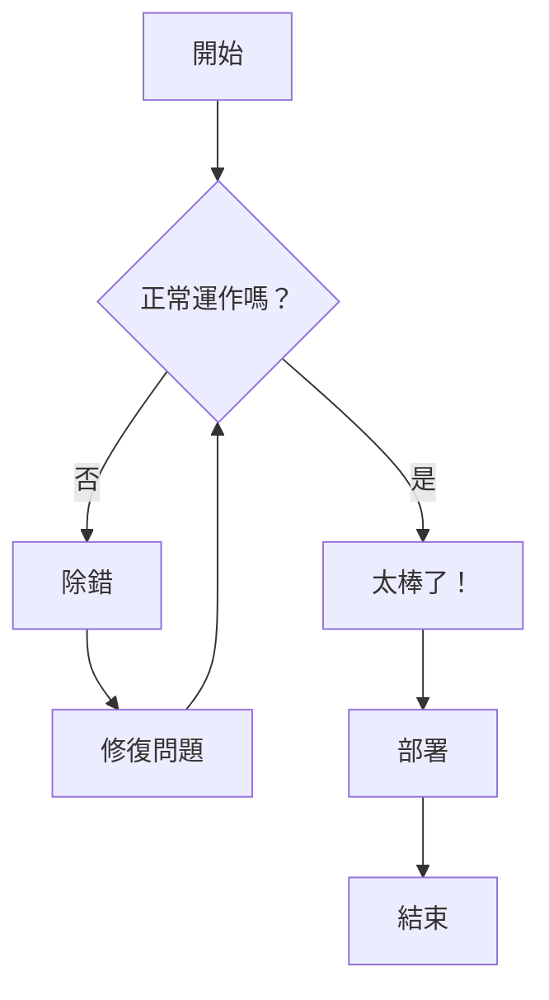
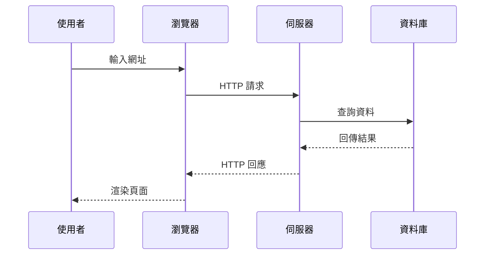
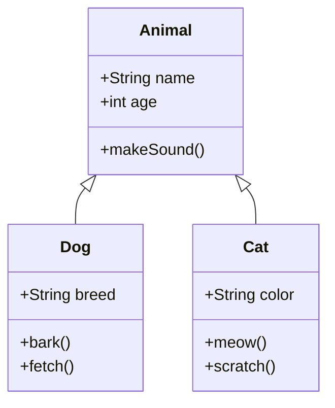
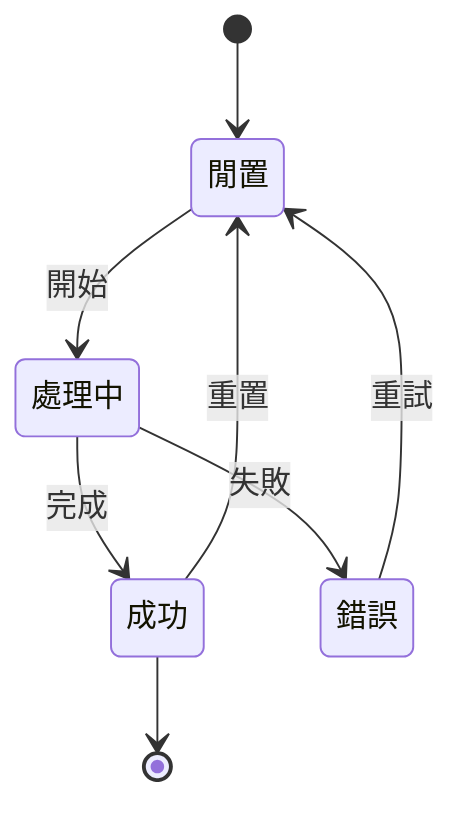
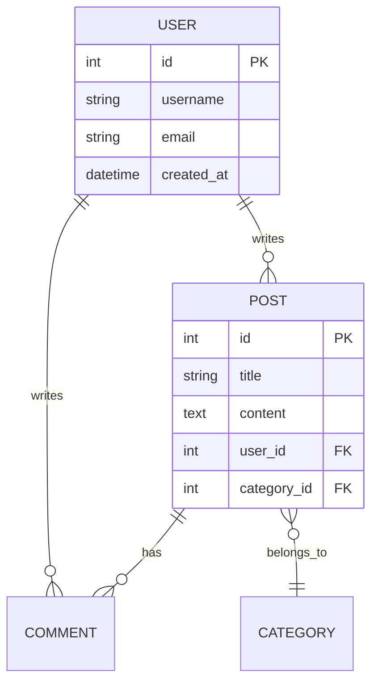
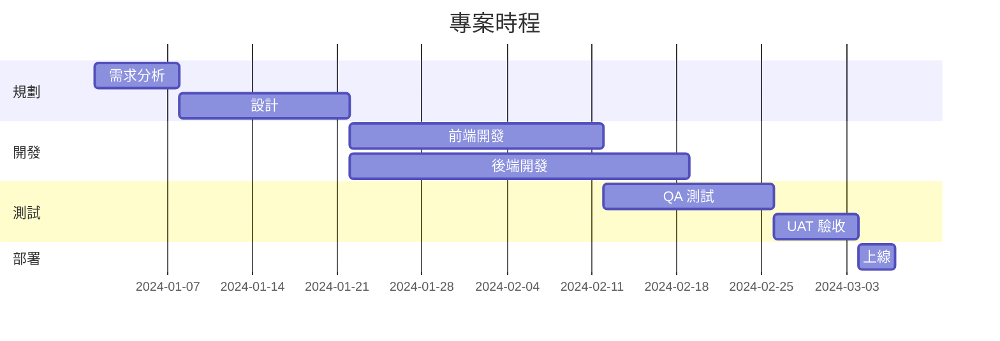
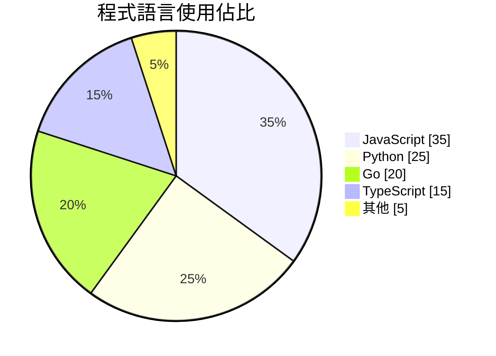
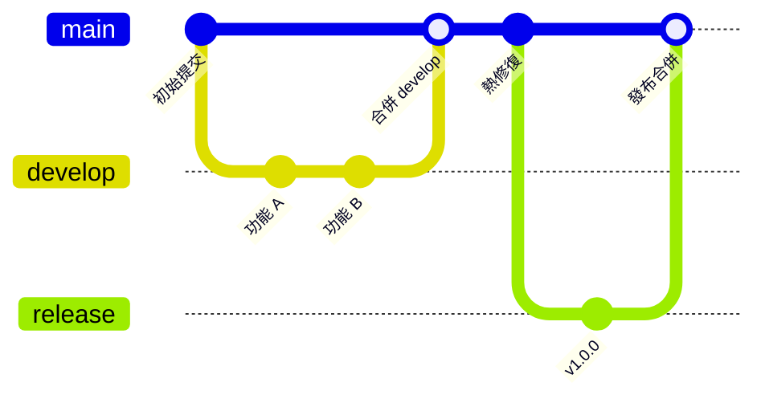
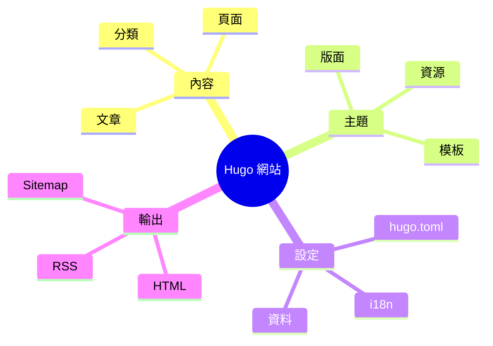
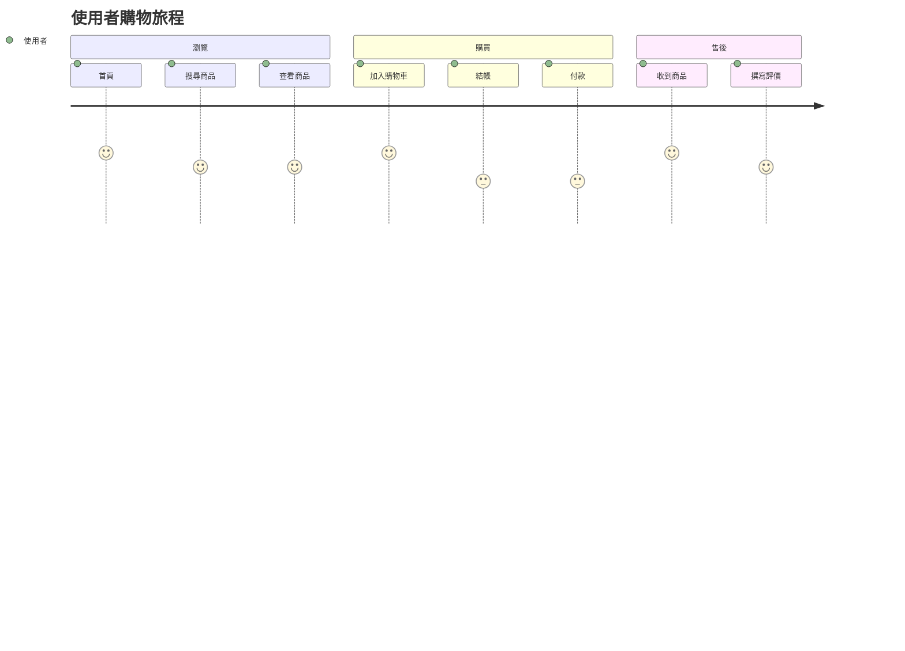

本文展示此 Hugo 模板支援的所有 Markdown 功能，包括擴充語法、程式碼區塊、圖表和數學公式。

<!--more-->

---

## 標題層級

# 一級標題
## 二級標題
### 三級標題
#### 四級標題
##### 五級標題
###### 六級標題

---

## 文字格式

這是**粗體文字**，這是*斜體文字*。

這是***粗體加斜體***的組合。

這是~~刪除線~~文字。

這是句子中的`行內程式碼`。

> 這是一段引用文字。它可以跨越多行，通常用於引用或強調重要資訊。
>
> — 作者名稱

### 巢狀引用

> 第一層引用
>> 第二層引用
>>> 第三層引用

---

## 清單

### 無序清單

- 項目 1
- 項目 2
  - 巢狀項目 2.1
  - 巢狀項目 2.2
    - 深層巢狀項目
- 項目 3

### 有序清單

1. 第一項
2. 第二項
   1. 子項 2.1
   2. 子項 2.2
3. 第三項

### 任務清單

- [x] 已完成任務
- [x] 另一個已完成任務
- [ ] 待處理任務
- [ ] 未來任務

---

## 連結與圖片

### 連結

- [外部連結](https://gohugo.io/)
- [帶標題的連結](https://gohugo.io/ "Hugo 官方網站")
- <https://gohugo.io/>（自動連結）
- 聯絡方式：<hello@example.com>

### 圖片


*圖 1：Hugo Logo*

---

## 表格

### 基本表格

| 表頭 1 | 表頭 2 | 表頭 3 |
|--------|--------|--------|
| 儲存格 1 | 儲存格 2 | 儲存格 3 |
| 儲存格 4 | 儲存格 5 | 儲存格 6 |
| 儲存格 7 | 儲存格 8 | 儲存格 9 |

### 對齊表格

| 靠左對齊 | 置中對齊 | 靠右對齊 |
|:---------|:--------:|---------:|
| 文字     | 文字     | 文字     |
| 更多文字 | 更多文字 | 更多文字 |
| 還有更多 | 還有更多 | 1,234.56 |

### 複雜表格

| 功能 | 免費版 | 專業版 | 企業版 |
|:-----|:------:|:------:|:------:|
| 使用者數 | 5 | 50 | 無限制 |
| 儲存空間 | 1 GB | 100 GB | 1 TB |
| 技術支援 | 電子郵件 | 優先 | 7×24 |
| 價格 | NT$0 | NT$990/月 | 客製 |

---

## 程式碼區塊

### 行內程式碼

使用 `hugo server` 指令啟動開發伺服器。

### JavaScript

```javascript
/**
 * 計算數字的階乘
 * @param {number} n - 輸入數字
 * @returns {number} 階乘結果
 */
function factorial(n) {
  if (n <= 1) return 1;
  return n * factorial(n - 1);
}

// 使用範例
const result = factorial(5);
console.log(`5! = ${result}`); // 輸出: 5! = 120
```

### Python

```python
from typing import List, Optional

class DataProcessor:
    """用於處理資料的類別，支援各種轉換操作。"""
    
    def __init__(self, data: List[int]):
        self.data = data
    
    def filter_positive(self) -> List[int]:
        """篩選並回傳正數。"""
        return [x for x in self.data if x > 0]
    
    def calculate_average(self) -> Optional[float]:
        """計算所有數字的平均值。"""
        if not self.data:
            return None
        return sum(self.data) / len(self.data)

# 使用範例
processor = DataProcessor([1, -2, 3, -4, 5])
print(f"正數: {processor.filter_positive()}")
print(f"平均值: {processor.calculate_average()}")
```

### Go

```go
package main

import (
    "fmt"
    "sync"
)

// SafeCounter 是執行緒安全的計數器
type SafeCounter struct {
    mu    sync.Mutex
    count int
}

// Increment 將計數器加 1
func (c *SafeCounter) Increment() {
    c.mu.Lock()
    defer c.mu.Unlock()
    c.count++
}

// Value 回傳目前計數
func (c *SafeCounter) Value() int {
    c.mu.Lock()
    defer c.mu.Unlock()
    return c.count
}

func main() {
    counter := &SafeCounter{}
    
    var wg sync.WaitGroup
    for i := 0; i < 1000; i++ {
        wg.Add(1)
        go func() {
            defer wg.Done()
            counter.Increment()
        }()
    }
    
    wg.Wait()
    fmt.Printf("最終計數: %d\n", counter.Value())
}
```

### TypeScript

```typescript
interface User {
  id: number;
  name: string;
  email: string;
  createdAt: Date;
}

class UserService {
  private users: Map<number, User> = new Map();

  /**
   * 新增使用者
   * @param user - 使用者資料
   * @returns 建立的使用者
   */
  createUser(user: Omit<User, 'id' | 'createdAt'>): User {
    const newUser: User = {
      ...user,
      id: this.users.size + 1,
      createdAt: new Date(),
    };
    this.users.set(newUser.id, newUser);
    return newUser;
  }

  /**
   * 根據 ID 取得使用者
   */
  getUserById(id: number): User | undefined {
    return this.users.get(id);
  }
}

// 使用範例
const service = new UserService();
const user = service.createUser({ name: 'Alice', email: 'alice@example.com' });
console.log(user);
```

### Shell / Bash

```bash
#!/bin/bash

# Hugo 網站部署腳本
set -e

echo "🚀 開始部署..."

# 建置網站
hugo --minify

# 部署到伺服器
rsync -avz --delete public/ user@server:/var/www/html/

echo "✅ 部署完成！"
```

### SQL

```sql
-- 建立使用者資料表
CREATE TABLE users (
    id SERIAL PRIMARY KEY,
    username VARCHAR(50) NOT NULL UNIQUE,
    email VARCHAR(100) NOT NULL UNIQUE,
    created_at TIMESTAMP DEFAULT CURRENT_TIMESTAMP
);

-- 帶 JOIN 的查詢
SELECT 
    u.username,
    COUNT(p.id) AS post_count
FROM users u
LEFT JOIN posts p ON u.id = p.user_id
GROUP BY u.id
HAVING COUNT(p.id) > 5
ORDER BY post_count DESC;
```

### Diff

```diff
- const oldFunction = () => {
-   return "old";
- };
+ const newFunction = () => {
+   return "new and improved";
+ };
```

---

## Mermaid 圖表

### 流程圖



### 時序圖



### 類別圖



### 狀態圖



### ER 圖



### 甘特圖



### 圓餅圖



### Git 圖



### 心智圖



### 使用者旅程圖



---

## YouTube 影片嵌入

這是一個嵌入的 YouTube 影片，展示響應式設計：



您也可以指定標題和開始時間：



---

## 數學公式

### 行內公式

著名的方程式 $E = mc^2$ 改變了物理學。

一元二次方程式公式是 $x = \frac{-b \pm \sqrt{b^2 - 4ac}}{2a}$。

圓的面積公式：$A = \pi r^2$

### 區塊公式

高斯積分：

$$
\int_{-\infty}^{\infty} e^{-x^2} dx = \sqrt{\pi}
$$

### 聯立方程式

$$
\begin{cases}
3x + 2y - z = 1 \\
2x - 2y + 4z = -2 \\
-x + \frac{1}{2}y - z = 0
\end{cases}
$$

### 矩陣

$$
\mathbf{A} = \begin{pmatrix}
a_{11} & a_{12} & a_{13} \\
a_{21} & a_{22} & a_{23} \\
a_{31} & a_{32} & a_{33}
\end{pmatrix}
$$

矩陣乘法：

$$
\begin{pmatrix}
a & b \\
c & d
\end{pmatrix}
\begin{pmatrix}
e & f \\
g & h
\end{pmatrix}
=
\begin{pmatrix}
ae+bg & af+bh \\
ce+dg & cf+dh
\end{pmatrix}
$$

### 求和與乘積

$$
\sum_{i=1}^{n} i = \frac{n(n+1)}{2}
$$

$$
\prod_{i=1}^{n} i = n!
$$

### 極限與導數

$$
\lim_{x \to 0} \frac{\sin x}{x} = 1
$$

$$
\frac{d}{dx}\left( x^n \right) = nx^{n-1}
$$

### 泰勒展開式

$$
e^x = \sum_{n=0}^{\infty} \frac{x^n}{n!} = 1 + x + \frac{x^2}{2!} + \frac{x^3}{3!} + \cdots
$$

### 傅立葉級數

$$
f(x) = \frac{a_0}{2} + \sum_{n=1}^{\infty} \left( a_n \cos\frac{n\pi x}{L} + b_n \sin\frac{n\pi x}{L} \right)
$$

### 薛丁格方程式

$$
i\hbar\frac{\partial}{\partial t}\Psi(\mathbf{r},t) = \left[ -\frac{\hbar^2}{2m}\nabla^2 + V(\mathbf{r},t) \right]\Psi(\mathbf{r},t)
$$

### 馬克士威方程組

$$
\begin{aligned}
\nabla \cdot \mathbf{E} &= \frac{\rho}{\varepsilon_0} \\
\nabla \cdot \mathbf{B} &= 0 \\
\nabla \times \mathbf{E} &= -\frac{\partial \mathbf{B}}{\partial t} \\
\nabla \times \mathbf{B} &= \mu_0\mathbf{J} + \mu_0\varepsilon_0\frac{\partial \mathbf{E}}{\partial t}
\end{aligned}
$$

### 統計公式

標準差：

$$
\sigma = \sqrt{\frac{1}{N}\sum_{i=1}^{N}(x_i - \mu)^2}
$$

常態分佈機率密度函數：

$$
f(x) = \frac{1}{\sigma\sqrt{2\pi}} e^{-\frac{1}{2}\left(\frac{x-\mu}{\sigma}\right)^2}
$$

---

## 註腳

這是一個帶有註腳的句子[^1]。

這是另一個帶有不同註腳的句子[^2]。

[^1]: 這是第一個註腳。
[^2]: 這是第二個註腳，包含更多詳細資訊。

---

## 定義清單

Hugo
: 一個用 Go 語言編寫的快速、現代的靜態網站產生器。

Markdown
: 一種用於建立格式化文字的輕量級標記語言。

Mermaid
: 一個基於 JavaScript 的圖表繪製工具。

KaTeX
: 一個快速的數學公式排版函式庫。

---

## 分隔線

三個或更多的破折號、星號或底線：

---

***

___

---

## 鍵盤按鍵

按 <kbd>Ctrl</kbd> + <kbd>C</kbd> 複製。

按 <kbd>Cmd</kbd> + <kbd>Shift</kbd> + <kbd>P</kbd> 開啟命令面板。

Mac 使用者按 <kbd>⌘</kbd> + <kbd>S</kbd> 儲存。

---

## 醒目標示文字

這是<mark>醒目標示文字</mark>，用於強調。

---

## 上標與下標

- 水：H<sub>2</sub>O
- 二氧化碳：CO<sub>2</sub>
- E = mc<sup>2</sup>
- x<sup>2</sup> + y<sup>2</sup> = z<sup>2</sup>

---

## 表情符號（如有支援）

- 🚀 火箭
- ✨ 閃耀
- 📝 書寫
- 💻 筆電
- 🎉 慶祝
- ⚡ 閃電
- 🔧 工具
- 📊 圖表

---

## 詳細資訊/摺疊區塊

<details>
<summary>點擊展開更多資訊</summary>

這是隱藏的內容，點擊上方標題可以展開或收合。

您可以在這裡放置：
- 額外的說明
- 程式碼範例
- 任何不想一開始就顯示的內容

```javascript
console.log("隱藏的程式碼");
```

</details>

---

## 總結

本文涵蓋了：

1. **基礎 Markdown** - 標題、文字格式、清單
2. **擴充語法** - 表格、任務清單、註腳
3. **程式碼區塊** - 多語言支援及語法醒目標示
4. **Mermaid 圖表** - 流程圖、時序圖、甘特圖等
5. **YouTube 嵌入** - 響應式影片嵌入
6. **數學公式** - KaTeX 支援複雜公式

在撰寫文章時，可以隨時參考本指南！

---

## 相關資源

- [Hugo 官方文件](https://gohugo.io/documentation/)
- [Markdown 語法指南](https://www.markdownguide.org/)
- [Mermaid 官方文件](https://mermaid.js.org/)
- [KaTeX 支援的函式](https://katex.org/docs/supported.html)
